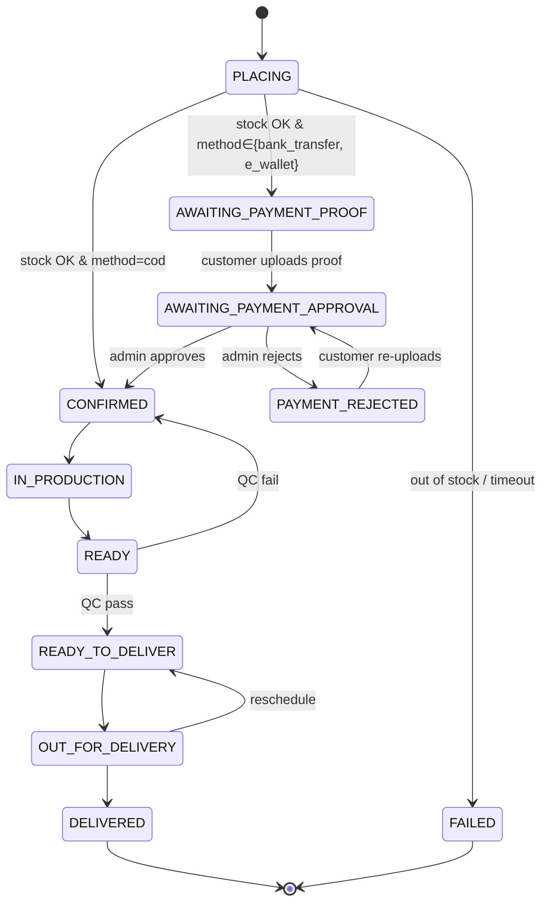
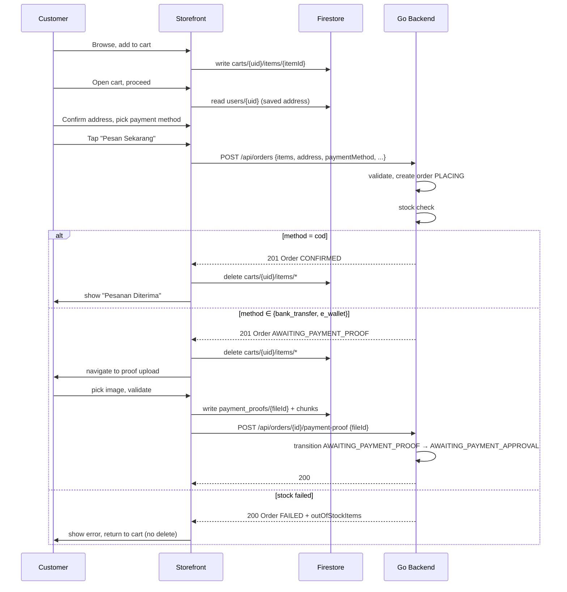
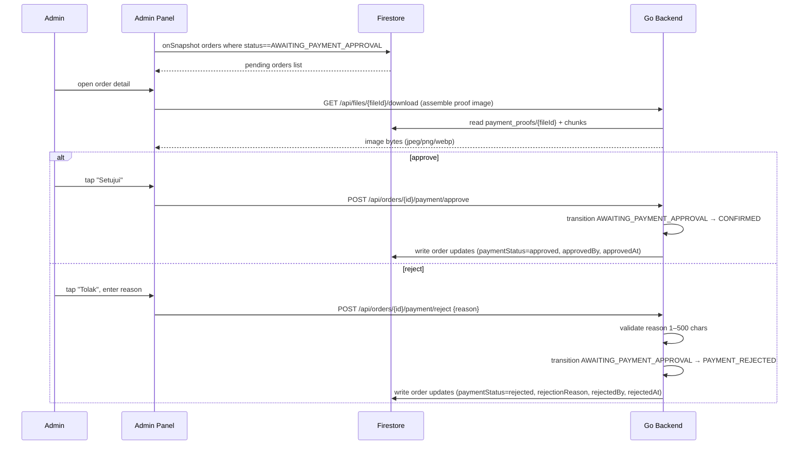
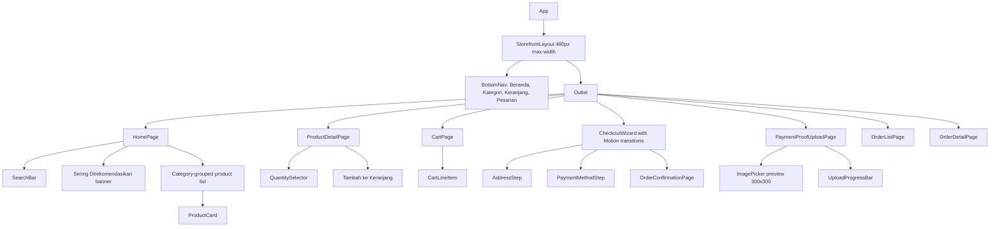
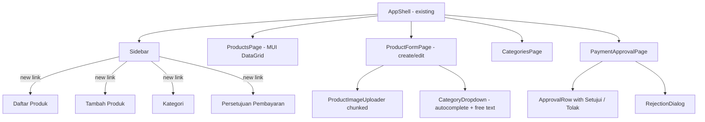

# Design Document: Customer Storefront & Admin Stock Management

## Overview

This design specifies two connected features built on the existing Al Umana stack:

1. A **mobile-first Customer Storefront** in Bahasa Indonesia where customers browse products, manage a server-side cart in Firestore, complete a 6-step ShopeeFood-inspired checkout (Browse → Product → Cart → Address → Payment → Confirmation), upload payment proofs for non-COD methods, and track their orders.
2. An **Admin Stock Management panel** where administrators perform CRUD on `InventoryItem` documents, upload product images using the existing Base64 chunking protocol, manage stock quantities and availability, organize products by category, and review/approve customer payment proofs.

Both features extend, rather than duplicate, the order-fulfillment-delivery-tracking system already in production:

- The `Order` state machine grows three new states (`AWAITING_PAYMENT_PROOF`, `AWAITING_PAYMENT_APPROVAL`, `PAYMENT_REJECTED`) and two new fields (`paymentStatus`, `paymentProofFileId`).
- The Base64 chunking protocol from `delivery_files` is reused in two new collections: `product_images` and `payment_proofs`.
- The existing `auth.Guard` middleware gates new endpoints; admin-only routes additionally check the `admin` Firebase custom claim.
- The existing `stock.InventoryItem` model is preserved; its `imageURL` field is repurposed to store a `product_images/{fileId}` reference rather than an HTTP URL (the field name is kept for backward compatibility).

### Key Design Goals

- **Reuse over rewrite**: Lean on the existing `auth`, `file`, `order`, and `stock` packages and the React `chunkUploadService`, parameterizing them rather than copying.
- **Single source of truth for payment lifecycle**: The Go backend owns Order status transitions, including the new payment statuses. The frontend only triggers transitions via API calls.
- **Real-time UX**: Cart, payment-approval queue, and order detail pages use Firestore `onSnapshot` listeners so updates propagate within 2 seconds without manual refresh.
- **Mobile-first, Indonesian-first**: The Storefront is designed for 320–480 px viewports with a max content width of 480 px on larger screens, all UI copy in Bahasa Indonesia, and the existing `#FBBF24` / `#111827` palette.

### Tech Stack Summary

| Layer            | Technology                                                                                  |
| ---------------- | ------------------------------------------------------------------------------------------- |
| Frontend         | React 18, TypeScript, Vite, Tailwind CSS v4, Motion (Framer Motion), Manrope/Hanken Grotesk |
| UI Libraries     | Radix UI, MUI v7 (DataGrid in admin), Lucide React (icons)                                  |
| Backend          | Go 1.24, net/http (Go 1.22 ServeMux), Firestore Admin SDK                                   |
| Database         | Firebase Firestore                                                                          |
| Auth             | Firebase Authentication (custom claims for `admin` role)                                    |
| Property Testing | `pgregory.net/rapid` (Go), `fast-check` (TypeScript, already in `package.json`)             |

---

## Architecture

### High-Level Architecture

```mermaid
graph TB
    subgraph Storefront["Storefront (Mobile React SPA)"]
        StoreUI[React Pages & Components]
        Cart[Cart Listener]
        OrderListener[Order Listener]
        ProofUploader[Payment Proof Chunker]
    end

    subgraph AdminPanel["Admin Panel (existing React SPA)"]
        AdminUI[Admin Pages]
        ImageUploader[Product Image Chunker]
        ApprovalListener[Payment Approval Listener]
    end

    subgraph Backend["Go Backend (extended)"]
        Router[HTTP Router / Auth Guard]
        CatalogSvc[Catalog Service]
        StockSvc[Stock Service - extended]
        OrderSvcExt[Order Service - extended state machine]
        ImageHandler[Product Image Handler]
        ProofHandler[Payment Proof Handler]
    end

    subgraph Firestore["Firestore"]
        Inventory[(inventory)]
        Carts[(carts/&#123;uid&#125;/items)]
        Users[(users)]
        Orders[(orders)]
        ProductImages[(product_images)]
        PaymentProofs[(payment_proofs)]
    end

    StoreUI -->|REST + Firestore SDK| Router
    Cart -->|onSnapshot| Carts
    OrderListener -->|onSnapshot| Orders
    ProofUploader -->|chunk writes| PaymentProofs
    AdminUI -->|REST| Router
    ImageUploader -->|chunk writes| ProductImages
    ApprovalListener -->|onSnapshot status=AWAITING_PAYMENT_APPROVAL| Orders
    Router --> CatalogSvc
    Router --> StockSvc
    Router --> OrderSvcExt
    Router --> ImageHandler
    Router --> ProofHandler
    CatalogSvc --> Inventory
    StockSvc --> Inventory
    StockSvc --> ProductImages
    OrderSvcExt --> Orders
    OrderSvcExt --> PaymentProofs
    ProofHandler --> PaymentProofs
    ImageHandler --> ProductImages
```



### Communication Patterns

1. **Customer/Admin → Go Backend**: REST over HTTPS with `Authorization: Bearer <Firebase-ID-token>`. The existing `auth.Guard` middleware verifies tokens; admin endpoints additionally check the `admin` custom claim.
2. **Customer → Firestore (direct)**: Cart writes (`carts/{uid}/items/{itemId}`) and payment-proof chunk writes (`payment_proofs/{fileId}/chunks/{index}`) use the Firestore client SDK with security rules enforcing per-user access.
3. **Firestore → Client (real-time)**: `onSnapshot` listeners drive the cart badge, cart view, payment-approval queue, and order detail status updates.
4. **Admin → Firestore (direct)**: Product-image chunk writes (`product_images/{fileId}/chunks/{index}`) use the Firestore client SDK; only authenticated admins can write per security rules.
5. **Backend → Firestore**: Server-side reads/writes via Admin SDK service-account credentials (existing `firestore.Client`).

### Order State Machine Reconciliation

The existing state machine (in `backend/internal/order/statemachine.go`) is extended with three new states and the corresponding edges. The original edges are preserved unchanged for COD orders; the new edges are added on the `PLACING` side and on a parallel `AWAITING_PAYMENT_*` track for non-COD orders.



The decision in `Service.CreateOrder` is split: after a successful stock check, the post-check transition is `CONFIRMED` for `cod` orders and `AWAITING_PAYMENT_PROOF` for non-COD orders. The existing `transitionAfterStock` helper is parameterized on `paymentMethod`.

### Storefront Checkout Flow



### Admin Payment Approval Flow



---

## Components and Interfaces

### Backend Package Layout (extensions)

```
backend/internal/
├── auth/                    (existing)
├── catalog/                 NEW — public read-only catalog endpoints
│   ├── handler.go
│   └── service.go
├── stock/                   EXTENDED — admin CRUD + image upload coordination
│   ├── models.go            (existing, unchanged: InventoryItem)
│   ├── repository.go        (existing) + Create, Update, Delete, ListAll, DistinctCategories
│   ├── service.go           EXTENDED — admin operations, image cleanup
│   ├── validation.go        NEW — InventoryItem validation
│   └── handler.go           NEW — REST handler
├── order/                   EXTENDED — payment statuses + transitions
│   ├── models.go            EXTENDED — new constants, paymentMethod, paymentStatus, paymentProofFileId
│   ├── statemachine.go      EXTENDED — new transitions
│   ├── service.go           EXTENDED — UploadProof, ApprovePayment, RejectPayment, ListByCustomer
│   ├── handler.go           EXTENDED — new endpoints
│   ├── requests.go          EXTENDED — paymentMethod, payment endpoints
│   └── validation.go        EXTENDED — paymentMethod, rejection reason already exists
├── file/                    GENERALIZED — collection name parameterized
│   └── repository.go        EXTENDED — accept collection name (delivery_files, product_images, payment_proofs)
└── router/
    └── router.go            EXTENDED — register new routes
```

The `file.Repository` is generalized to accept the target collection name as a constructor parameter. Three thin wrappers expose the existing semantics while pointing at the right collection:

```go
// New constructor signature (backwards compatible: NewRepository keeps delivery_files default)
func NewRepositoryFor(client *firestore.Client, collection string) *Repository

// Convenience wrappers
func NewDeliveryFilesRepository(c *firestore.Client) *Repository { return NewRepositoryFor(c, "delivery_files") }
func NewProductImagesRepository(c *firestore.Client) *Repository { return NewRepositoryFor(c, "product_images") }
func NewPaymentProofsRepository(c *firestore.Client) *Repository { return NewRepositoryFor(c, "payment_proofs") }
```

The `Assembler` is unchanged; it consumes any `fileRepository` that implements `GetMetadata` and `ListChunks`.

### Backend HTTP Endpoints

| Method | Path                                    | Auth          | Description                                                                                          |
| ------ | --------------------------------------- | ------------- | ---------------------------------------------------------------------------------------------------- |
| GET    | `/api/catalog/items`                    | optional      | Public catalog: items with `available=true` and `quantity>0`, optional `category` filter             |
| GET    | `/api/catalog/items/{id}`               | optional      | Public product detail                                                                                |
| GET    | `/api/catalog/categories`               | optional      | Distinct non-empty category strings                                                                  |
| POST   | `/api/admin/inventory`                  | admin         | Create InventoryItem                                                                                 |
| GET    | `/api/admin/inventory`                  | admin         | List all InventoryItems (admin view, no availability filter)                                         |
| GET    | `/api/admin/inventory/{id}`             | admin         | Read single item                                                                                     |
| PUT    | `/api/admin/inventory/{id}`             | admin         | Full replace                                                                                         |
| PATCH  | `/api/admin/inventory/{id}/stock`       | admin         | Quantity-only update                                                                                 |
| DELETE | `/api/admin/inventory/{id}`             | admin         | Delete + cascade product image cleanup                                                               |
| GET    | `/api/admin/inventory/categories`       | admin         | Distinct categories (admin view)                                                                     |
| GET    | `/api/files/{collection}/{id}/download` | authenticated | Assemble & return chunked file (collection ∈ {`product_images`, `payment_proofs`, `delivery_files`}) |
| POST   | `/api/orders`                           | customer      | EXTENDED: accepts `paymentMethod`; returns CONFIRMED or AWAITING_PAYMENT_PROOF                       |
| GET    | `/api/orders/mine`                      | customer      | Customer's own orders, paginated, `customerID` from token                                            |
| POST   | `/api/orders/{id}/payment-proof`        | customer      | Set `paymentProofFileId`, transition to AWAITING_PAYMENT_APPROVAL                                    |
| POST   | `/api/orders/{id}/payment/approve`      | admin         | Transition AWAITING_PAYMENT_APPROVAL → CONFIRMED                                                     |
| POST   | `/api/orders/{id}/payment/reject`       | admin         | Transition AWAITING_PAYMENT_APPROVAL → PAYMENT_REJECTED with reason                                  |

### Frontend Storefront Routes

```
/                          → HomePage (catalog with categories + "Sering Direkomendasikan" banner + search)
/category/:name            → CategoryPage (filtered listing)
/product/:id               → ProductDetailPage (image, quantity selector, add to cart)
/cart                      → CartPage (line items, totals, "Lanjutkan")
/checkout/address          → AddressStep
/checkout/payment          → PaymentMethodStep
/checkout/payment-proof/:orderId → PaymentProofUploadPage
/orders                    → OrderListPage ("Pesanan Saya")
/orders/:id                → OrderDetailPage
/login, /register          → existing auth pages
```

### Frontend Component Hierarchy (Storefront)



### Frontend Component Hierarchy (Admin Panel additions)



### Key Service Modules (Frontend)

```typescript
// frontend/src/services/catalogService.ts (new)
export async function listAvailableProducts(): Promise<InventoryItem[]>;
export async function getProduct(id: string): Promise<InventoryItem>;
export async function listCategories(): Promise<string[]>;

// frontend/src/services/cartService.ts (new) — direct Firestore client SDK
export function subscribeToCart(uid: string, cb: (items: CartLineItem[]) => void): Unsubscribe;
export async function addToCart(uid: string, item: InventoryItem, qty: number, notes?: string): Promise<void>;
export async function setLineQuantity(uid: string, itemId: string, qty: number): Promise<void>;
export async function removeLineItem(uid: string, itemId: string): Promise<void>;
export async function clearCart(uid: string): Promise<void>;
export function computeCartTotal(items: CartLineItem[]): number;
export function formatIDR(value: number): string;

// frontend/src/services/stockAdminService.ts (new)
export async function listAllItems(opts?: { category?: string }): Promise<InventoryItem[]>;
export async function createItem(input: CreateInventoryItem): Promise<InventoryItem>;
export async function updateItem(id: string, input: UpdateInventoryItem): Promise<InventoryItem>;
export async function patchStock(id: string, qty: number): Promise<InventoryItem>;
export async function deleteItem(id: string): Promise<void>;

// frontend/src/services/chunkUploadService.ts (extended)
export async function uploadFileInChunks(
  file: File,
  opts: { collection: 'delivery_files' | 'product_images' | 'payment_proofs'; orderId?: string; itemId?: string; onProgress?: ... }
): Promise<UploadResult>;

// frontend/src/services/paymentProofService.ts (new)
export async function uploadPaymentProof(orderId: string, file: File, onProgress: ...): Promise<{ fileId: string }>;

// frontend/src/services/orderService.ts (extended)
export async function createOrder(req: CreateOrderRequest): Promise<Order>;
export async function listMyOrders(cursor?: string, limit?: number): Promise<{ orders: Order[]; next?: string }>;
export async function approvePayment(orderId: string): Promise<Order>;
export async function rejectPayment(orderId: string, reason: string): Promise<Order>;
export async function attachPaymentProof(orderId: string, fileId: string): Promise<Order>;
export function subscribeToOrder(orderId: string, cb: (o: Order) => void): Unsubscribe;
export function subscribeToPaymentApprovalQueue(cb: (orders: Order[]) => void): Unsubscribe;
```

### Cart Persistence Strategy

The Cart lives in Firestore at `carts/{customerId}/items/{itemId}` so it persists across sessions and devices (Requirement 3.6). The frontend uses the Firestore client SDK directly so:

- Writes are atomic per line item.
- An `onSnapshot` listener on the parent collection drives the cart badge and cart view simultaneously (Requirement 3.7, 3.8).
- The Order creation handler does not consume Cart data — the frontend constructs the `items` array of the `CreateOrderRequest` from the current cart snapshot, and on success deletes the line-item documents (Requirement 6.3, 6.4).

Firestore Security Rules (additions):

```
match /carts/{customerId}/items/{itemId} {
  allow read, write: if request.auth != null && request.auth.uid == customerId;
}
match /payment_proofs/{fileId} {
  allow read: if request.auth != null;             // admin reads + owner reads
  allow create: if request.auth != null && request.resource.data.uploadedBy == request.auth.uid;
  allow update: if request.auth != null;            // backend updates status; client may finalize via API
  allow delete: if request.auth != null && resource.data.uploadedBy == request.auth.uid;
  match /chunks/{chunkId} {
    allow read, write: if request.auth != null;
  }
}
match /product_images/{fileId} {
  allow read: if true;                              // images are public
  allow write: if request.auth != null && request.auth.token.role == 'admin';
  match /chunks/{chunkId} {
    allow read: if true;
    allow write: if request.auth != null && request.auth.token.role == 'admin';
  }
}
match /inventory/{id} {
  allow read: if true;
  allow write: if request.auth != null && request.auth.token.role == 'admin';
}
```

---

## Data Models

### Extended Order Model (Go)

```go
// backend/internal/order/models.go (additions)

const (
    StatusAwaitingPaymentProof    OrderStatus = "AWAITING_PAYMENT_PROOF"
    StatusAwaitingPaymentApproval OrderStatus = "AWAITING_PAYMENT_APPROVAL"
    StatusPaymentRejected         OrderStatus = "PAYMENT_REJECTED"
)

type PaymentMethod string

const (
    PaymentCOD          PaymentMethod = "cod"
    PaymentBankTransfer PaymentMethod = "bank_transfer"
    PaymentEWallet      PaymentMethod = "e_wallet"
)

type PaymentStatus string

const (
    PaymentStatusAwaitingProof    PaymentStatus = "awaiting_proof"
    PaymentStatusAwaitingApproval PaymentStatus = "awaiting_approval"
    PaymentStatusApproved         PaymentStatus = "approved"
    PaymentStatusRejected         PaymentStatus = "rejected"
)

// Order struct (extended)
type Order struct {
    // ... existing fields ...
    PaymentMethod        PaymentMethod  `json:"paymentMethod" firestore:"paymentMethod"`
    PaymentStatus        PaymentStatus  `json:"paymentStatus,omitempty" firestore:"paymentStatus,omitempty"`
    PaymentProofFileID   string         `json:"paymentProofFileId,omitempty" firestore:"paymentProofFileId,omitempty"`
    PaymentApprovedBy    string         `json:"paymentApprovedBy,omitempty" firestore:"paymentApprovedBy,omitempty"`
    PaymentApprovedAt    *time.Time     `json:"paymentApprovedAt,omitempty" firestore:"paymentApprovedAt,omitempty"`
    PaymentRejectedBy    string         `json:"paymentRejectedBy,omitempty" firestore:"paymentRejectedBy,omitempty"`
    PaymentRejectedAt    *time.Time     `json:"paymentRejectedAt,omitempty" firestore:"paymentRejectedAt,omitempty"`
    PaymentRejectReason  string         `json:"paymentRejectionReason,omitempty" firestore:"paymentRejectionReason,omitempty"`
}
```

### Extended State Machine Table

```go
// backend/internal/order/statemachine.go (extended)

var validTransitions = map[OrderStatus]map[OrderStatus]struct{}{
    StatusPlacing: {
        StatusConfirmed:             {}, // cod path
        StatusAwaitingPaymentProof:  {}, // non-cod path
        StatusFailed:                {},
    },
    StatusAwaitingPaymentProof: {
        StatusAwaitingPaymentApproval: {},
    },
    StatusAwaitingPaymentApproval: {
        StatusConfirmed:        {},
        StatusPaymentRejected:  {},
    },
    StatusPaymentRejected: {
        StatusAwaitingPaymentApproval: {}, // re-upload
    },
    StatusConfirmed:      { StatusInProduction: {} },
    StatusInProduction:   { StatusReady: {} },
    StatusReady:          { StatusReadyToDeliver: {}, StatusConfirmed: {} },
    StatusReadyToDeliver: { StatusOutForDelivery: {} },
    StatusOutForDelivery: { StatusReadyToDeliver: {}, StatusDelivered: {} },
}
```

### CreateOrderRequest (Go, extended)

```go
type CreateOrderRequest struct {
    CustomerName    string          `json:"customerName"`
    DeliveryAddress string          `json:"deliveryAddress"`
    DeliveryTime    string          `json:"deliveryTime"`
    PaymentMethod   PaymentMethod   `json:"paymentMethod"`
    Items           []OrderLineItem `json:"items"`
}
```

### Cart Line Item (Firestore + TypeScript)

```typescript
// Firestore: carts/{customerId}/items/{itemId}
interface CartLineItem {
  itemId: string; // also the document ID
  itemName: string;
  unitPrice: number; // IDR smallest unit
  quantity: number; // 1..99
  notes: string; // 0..200 chars
  updatedAt: Timestamp;
}
```

### InventoryItem (existing — preserved)

```go
// backend/internal/stock/models.go (unchanged)
type InventoryItem struct {
    ID        string    `json:"id" firestore:"-"`
    ItemName  string    `json:"itemName" firestore:"itemName"`
    Quantity  int       `json:"quantity" firestore:"quantity"`
    Unit      string    `json:"unit" firestore:"unit"`
    Price     int64     `json:"price" firestore:"price"`
    Available bool      `json:"available" firestore:"available"`
    Category  string    `json:"category,omitempty" firestore:"category,omitempty"`
    ImageURL  string    `json:"imageUrl,omitempty" firestore:"imageUrl,omitempty"` // stores "product_images/{fileId}"
    UpdatedAt time.Time `json:"updatedAt" firestore:"updatedAt"`
}
```

### File Metadata (existing — generalized)

The same `FileMetadata` and `FileChunk` shapes are used across all three collections. Only `payment_proofs` documents carry an `orderId` field; `product_images` documents do not (the link is stored on the `InventoryItem.ImageURL` field instead). The JSON struct tags use `omitempty` on `OrderID` so it is absent on product-image documents.

### User Profile (Firestore)

```typescript
// users/{uid}
interface UserProfile {
  uid: string;
  email: string;
  displayName: string;
  role: "customer" | "admin"; // mirrored from Firebase custom claim
  savedDeliveryAddress?: string; // pre-fill at checkout
  createdAt: Timestamp;
  updatedAt: Timestamp;
}
```

### Validation Rules Summary

| Field                      | Rule                                                     |
| -------------------------- | -------------------------------------------------------- |
| `InventoryItem.itemName`   | trim, 1–200 chars                                        |
| `InventoryItem.quantity`   | int, 0–99,999                                            |
| `InventoryItem.unit`       | trim, 1–50 chars                                         |
| `InventoryItem.price`      | int64 ≥ 0                                                |
| `InventoryItem.category`   | trim, 1–50 chars (required per Req 13.3/13.4)            |
| `InventoryItem.imageURL`   | ≤ 2048 chars; if set, format `product_images/{fileId}`   |
| `CartLineItem.quantity`    | int, 1–99                                                |
| `CartLineItem.notes`       | string, 0–200 chars                                      |
| `Order.deliveryAddress`    | trim, 10–500 chars (Req 4.3)                             |
| `Order.paymentMethod`      | one of `cod`, `bank_transfer`, `e_wallet`                |
| `payment rejection reason` | trim, 1–500 chars                                        |
| Image file                 | MIME ∈ {image/jpeg, image/png, image/webp}, size ≤ 15 MB |

---

## Correctness Properties

_A property is a characteristic or behavior that should hold true across all valid executions of a system — essentially, a formal statement about what the system should do. Properties serve as the bridge between human-readable specifications and machine-verifiable correctness guarantees._

The following 32 properties were derived from the prework analysis after consolidating redundant criteria. Each property is universally quantified and traceable to one or more acceptance criteria.

### Property 1: Catalog filter correctness

_For any_ set of `InventoryItem` documents and _for any_ optional category filter `c`, the result of `listAvailableProducts(items, c)` equals exactly the items satisfying `available = true ∧ quantity > 0` (and `category = c` when `c` is provided).

**Validates: Requirements 1.1, 1.3, 13.5**

### Property 2: Catalog grouping order

_For any_ set of available `InventoryItem` documents, the grouped catalog produced by `groupByCategory(items)` (a) lists categories in alphabetical order, (b) lists items alphabetically by `itemName` within each category, and (c) is a partition of the input (every input appears in exactly one group).

**Validates: Requirements 1.2**

### Property 3: IDR formatting

_For any_ non-negative integer `n`, `formatIDR(n)` equals `"Rp " + dotThousands(n)`, where `dotThousands` inserts a period every three digits from the right (e.g., `25000 → "25.000"`); the result begins with the prefix `"Rp "`, contains no trailing decimal, and `parseIDR(formatIDR(n)) = n` (round-trip).

**Validates: Requirements 1.4, 2.2, 3.10, 5.5, 8.3, 9.3**

### Property 4: Item-name truncation

_For any_ string `s` and limit `L = 80`, `truncate(s, L)` produces a string whose length is at most `L`, equals `s` when `len(s) ≤ L`, and otherwise ends with the ellipsis character `"…"`.

**Validates: Requirements 1.4**

### Property 5: Quantity selector clamp

_For any_ available stock quantity `Q ≥ 1` and _for any_ sequence of increment, decrement, and direct-set operations starting from the default value of 1, the displayed quantity stays in the closed interval `[1, Q]` after every operation.

**Validates: Requirements 2.4, 2.5**

### Property 6: Cart line-item round-trip

_For any_ valid combination of `(InventoryItem item, quantity q ∈ [1,99], notes n ∈ strings of length ≤ 200)`, calling `addToCart(uid, item, q, n)` writes a document at `carts/{uid}/items/{item.id}` whose fields, when read back, equal the projection `{ itemId: item.id, itemName: item.itemName, unitPrice: item.price, quantity: q, notes: n, updatedAt: serverTimestamp }`.

**Validates: Requirements 3.2, 3.3, 3.14**

### Property 7: Cart aggregation invariants

_For any_ initial cart state and _for any_ finite sequence of operations from `{ addToCart, setLineQuantity, removeLineItem }`, after each operation the cart satisfies all of the following: (a) the number of line documents equals the number of unique `itemId` values; (b) every persisted line has `quantity ∈ [1, 99]` and lines whose quantity reaches 0 are deleted; (c) `cartTotal = Σ unitPrice × quantity` over the persisted lines; (d) the badge count equals the number of persisted lines; (e) `removeLineItem(itemId)` deletes only that line and leaves all other lines unchanged.

**Validates: Requirements 3.4, 3.5, 3.8, 3.9, 3.10, 3.12, 3.13**

### Property 8: Address validation

_For any_ string `s`, `isValidAddress(s)` returns `true` if and only if `10 ≤ len(trim(s)) ≤ 500`.

**Validates: Requirements 4.3**

### Property 9: Payment instruction visibility

_For any_ sequence of payment-method selections from `{cod, bank_transfer, e_wallet}`, after each selection the payment-instructions section is visible if and only if the current method is in `{bank_transfer, e_wallet}`.

**Validates: Requirements 5.6, 5.7, 5.8**

### Property 10: Order placement transition

_For any_ valid `CreateOrderRequest req` and any stock-check outcome, after `Service.CreateOrder(req)` completes successfully, the persisted Order's status equals (a) `CONFIRMED` when `req.paymentMethod = cod` and stock is available; (b) `AWAITING_PAYMENT_PROOF` with `paymentStatus = awaiting_proof` when `req.paymentMethod ∈ {bank_transfer, e_wallet}` and stock is available; (c) `FAILED` when stock is unavailable or the stock check times out, regardless of `paymentMethod`.

**Validates: Requirements 6.1, 7.1**

### Property 11: Proof upload accessibility

_For any_ `Order o`, the customer can reach the payment-proof upload screen for `o` if and only if `o.status ∈ {AWAITING_PAYMENT_PROOF, PAYMENT_REJECTED}`.

**Validates: Requirements 7.2**

### Property 12: Image upload validation

_For any_ candidate file with MIME type `m` and size `n` bytes, `validateImageUpload(m, n)` returns `accepted` if and only if `m ∈ {image/jpeg, image/png, image/webp} ∧ n ≤ 15,728,640`; in all other cases it returns a rejection identifying which rule failed and no Firestore writes occur.

**Validates: Requirements 7.3, 7.4, 7.5, 11.1, 11.2, 11.3**

### Property 13: Chunking protocol round-trip

_For any_ byte array `b` with `len(b) ≤ 15,728,640` and any MIME type `m ∈ {image/jpeg, image/png, image/webp}`, splitting `b` into chunks of at most 524,288 bytes, Base64-encoding each chunk, prepending the Data_URI prefix `data:{m};base64,` to chunk 0, persisting all chunks, and then concatenating the chunks in index order, stripping the Data_URI prefix from the head, and Base64-decoding the result yields a byte array equal to `b`; in addition, the total chunk count is in `[1, 30]` and each chunk's pre-encoded source slice is at most 524,288 bytes.

**Validates: Requirements 7.6, 7.7, 11.4, 11.5, 11.8**

### Property 14: Successful proof finalization

_For any_ `Order o` with `o.status ∈ {AWAITING_PAYMENT_PROOF, PAYMENT_REJECTED}` and any successfully completed proof upload yielding `fileId`, after the finalization call the persisted Order has `status = AWAITING_PAYMENT_APPROVAL`, `paymentStatus = awaiting_approval`, `paymentProofFileId = "payment_proofs/{fileId}"`, and the parent file document at `payment_proofs/{fileId}` has `status = "completed"`.

**Validates: Requirements 7.9**

### Property 15: Failed or cancelled upload preserves Order

_For any_ `Order o` and _for any_ upload that aborts before all chunks are written (whether due to a chunk-write failure or an explicit cancel), the Order document is byte-equal pre and post (including `status`, `paymentStatus`, and `paymentProofFileId`); the parent file document's `status` ends as `"failed"` (chunk-write failure) or remains in its written form without affecting the Order.

**Validates: Requirements 7.10, 7.11, 11.13**

### Property 16: Re-upload deletes previous proof

_For any_ `Order o` with `o.status = PAYMENT_REJECTED` and a non-empty `o.paymentProofFileId = "payment_proofs/{old}"`, after a successful re-upload yielding `new`, the Order satisfies `paymentProofFileId = "payment_proofs/{new}"` and the documents at `payment_proofs/{old}` and all of its `chunks` are absent.

**Validates: Requirements 7.12**

### Property 17: Assembly error handling

_For any_ malformed chunked file — any of (a) actual chunk count differs from the parent's `totalChunks`, (b) `totalChunks > 30`, (c) any chunk has `index ∉ [0, totalChunks − 1]`, or (d) the concatenated payload fails Base64 decoding — `Assembler.Assemble` returns an error identifying the failure cause, no `Order` document and no `InventoryItem` document is mutated, and the UI displays a fallback placeholder.

**Validates: Requirements 7.13, 11.12**

### Property 18: Admin authorization

_For any_ user role `r ∈ {anonymous, customer, admin}` and _for any_ protected route or API endpoint in the system, the access decision returned by `authorize(r, route)` matches the design's route-role decision table — admin endpoints require `r = admin`, customer write endpoints require `r ∈ {customer, admin}`, and read-only catalog routes accept any role.

**Validates: Requirements 8.1, 10.7, 16.1, 16.2, 16.3, 16.5**

### Property 19: Approve transition

_For any_ `Order o` with `o.status = AWAITING_PAYMENT_APPROVAL` and _for any_ admin actor with UID `u`, calling `Service.ApprovePayment(o.id, u)` produces a post-state with `status = CONFIRMED`, `paymentStatus = approved`, `paymentApprovedBy = u`, and `paymentApprovedAt` set to a timestamp `t` such that `pre ≤ t ≤ post` (where `pre`/`post` bracket the call); all other Order fields are unchanged.

**Validates: Requirements 8.5**

### Property 20: Reject transition

_For any_ `Order o` with `o.status = AWAITING_PAYMENT_APPROVAL`, _for any_ admin actor with UID `u`, and _for any_ reason string `r`: when `1 ≤ len(trim(r)) ≤ 500`, `Service.RejectPayment(o.id, u, r)` produces a post-state with `status = PAYMENT_REJECTED`, `paymentStatus = rejected`, `paymentRejectionReason = trim(r)`, `paymentRejectedBy = u`, and `paymentRejectedAt` set to a timestamp `t ∈ [pre, post]`; when the reason is invalid, the call returns a validation error and the Order document is byte-equal pre and post.

**Validates: Requirements 8.7, 8.8**

### Property 21: Wrong-status payment action

_For any_ `Order o` with `o.status ≠ AWAITING_PAYMENT_APPROVAL`, both `Service.ApprovePayment(o.id, ·)` and `Service.RejectPayment(o.id, ·, ·)` return `INVALID_STATE_TRANSITION` and the Order document is byte-equal pre and post.

**Validates: Requirements 8.9**

### Property 22: My-orders projection

_For any_ set of `Order` documents and _for any_ customer UID `uid`, `listMyOrders(uid, limit)` returns at most `min(limit, 50)` orders, every returned order satisfies `customerID = uid`, the returned orders are sorted by `createdAt` descending, and the page cursor (when present) corresponds to the last returned order's `createdAt`; additionally, for any returned order `o`, `itemCount(o) = Σ item.quantity` over `o.items`.

**Validates: Requirements 9.2, 9.3**

### Property 23: Status label mapping

_For every_ value of the `OrderStatus` enumeration, `statusLabel(s)` returns exactly the Bahasa Indonesian string defined in the spec table (e.g., `PLACING → "Menunggu Konfirmasi"`, `AWAITING_PAYMENT_PROOF → "Menunggu Bukti Pembayaran"`, `DELIVERED → "Terkirim"`, etc.).

**Validates: Requirements 9.5**

### Property 24: Inventory CRUD round-trip

_For any_ valid `CreateInventoryItem c`, after `stock.Service.Create(c)` returning ID `id`, `stock.Service.Get(id)` returns an `InventoryItem` whose user-controlled fields equal those of `c`; _for any_ valid `UpdateInventoryItem u` and existing `id`, `Update(id, u)` then `Get(id)` returns a value reflecting `u`; _for any_ existing `id`, `Delete(id)` followed by `Get(id)` returns `ErrNotFound`; _for any_ non-existent `id`, `Update`, `Delete`, and `PatchStock` return `ErrNotFound` (HTTP 404).

**Validates: Requirements 10.1, 10.3, 10.4, 10.8, 10.9, 10.10, 12.7**

### Property 25: Inventory listing cap

_For any_ inventory population and _for any_ combination of filters (category, availability), `stock.Service.List(filters)` returns at most 200 items, every returned item satisfies the filter predicates, and every item in the population that satisfies the filter and fits within the cap is included.

**Validates: Requirements 10.2**

### Property 26: Inventory updatedAt freshness

_For any_ successful call to `stock.Service.Create` or `stock.Service.Update` made between wall-clock instants `pre` and `post`, the persisted `InventoryItem.UpdatedAt` satisfies `pre ≤ UpdatedAt ≤ post`.

**Validates: Requirements 10.5**

### Property 27: Inventory validation

_For any_ candidate `CreateInventoryItem` (or `UpdateInventoryItem`) input, `validateInventoryItem(input)` returns no errors if and only if all of the following hold: `1 ≤ len(trim(itemName)) ≤ 200`, `0 ≤ quantity ≤ 99,999`, `1 ≤ len(trim(unit)) ≤ 50`, `price ≥ 0`, and `1 ≤ len(trim(category)) ≤ 50`. When the input is invalid, the returned error list contains exactly one entry per violated field, identifying that field by name.

**Validates: Requirements 10.6, 12.5, 13.3, 13.4**

### Property 28: Image attach round-trip

_For any_ `InventoryItem item` and _for any_ successful image upload yielding `newFileId`, calling `setItemImage(item.id, newFileId)` persists `item.imageURL = "product_images/{newFileId}"`; if `item.imageURL` previously referenced `"product_images/{oldFileId}"`, after the call the parent and chunks at `product_images/{oldFileId}` are absent. Calling `removeItemImage(item.id)` sets `item.imageURL = ""` and ensures the previously referenced parent and chunks are absent.

**Validates: Requirements 11.7, 11.9, 11.11**

### Property 29: Quantity-availability invariant

_For any_ `InventoryItem` and _for any_ finite sequence of `setQuantity(q)` and `setAvailable(b)` operations, the post-state satisfies the implication `available = true ⇒ quantity > 0`; in particular, every call `setQuantity(0)` on the item results in `available = false`.

**Validates: Requirements 12.2, 12.3**

### Property 30: Distinct categories aggregation

_For any_ set of `InventoryItem` documents, `distinctCategories(items)` returns the lexicographically sorted set of distinct `trim(item.category)` values across all items where `trim(item.category)` is non-empty.

**Validates: Requirements 13.1, 13.6**

### Property 31: Recommended banner selection

_For any_ set of `InventoryItem` documents, `recommendedBanner(items)` returns at most 5 items, every returned item satisfies `available = true ∧ quantity > 0`, the returned items are sorted by `updatedAt` descending, and the returned set is the prefix of length `min(5, |available items|)` of the available items sorted by `updatedAt` descending.

**Validates: Requirements 14.8**

### Property 32: Search filter correctness

_For any_ set of `InventoryItem` documents and _for any_ search query string `q`: when `len(q) ≥ 2`, the search result equals `{ i ∈ items : toLower(i.itemName) contains toLower(q) }` (presented as a flat list, no category grouping); when `len(q) < 2`, the search is inactive and the displayed list is the grouped catalog from Property 2.

**Validates: Requirements 17.2, 17.4**

---

## Error Handling

### Error Categories

| Layer            | Category              | Example                                                 | User-facing behavior                                                                                         |
| ---------------- | --------------------- | ------------------------------------------------------- | ------------------------------------------------------------------------------------------------------------ |
| Catalog          | Service unavailable   | Firestore timeout > 10s                                 | Show `"Katalog tidak tersedia, coba lagi."` with retry button                                                |
| Cart             | Permission denied     | Wrong UID in path                                       | Toast `"Tidak dapat memperbarui keranjang."` + retry; UI state from snapshot listener                        |
| Cart             | Network error         | Firestore offline                                       | Toast + retry; offline buffering relies on Firebase SDK                                                      |
| Address          | Validation            | Length out of range                                     | Inline `"Alamat harus 10–500 karakter."` and disabled "Lanjutkan"                                            |
| Address          | Profile save failure  | Firestore write error                                   | Inline error + still allow proceed for current order                                                         |
| Order            | Validation            | Field-specific errors                                   | Field-level messages on the form, no submission                                                              |
| Order            | Out of stock          | Service returns FAILED + outOfStockItems                | List item names, return to cart, do not delete cart                                                          |
| Order            | Stock service timeout | Service returns FAILED + reason "stock service timeout" | Generic retry message                                                                                        |
| Order            | Network/timeout 15s   | No response in 15s                                      | Connection error + retry, cart preserved                                                                     |
| Payment proof    | MIME/size validation  | Wrong format or > 15 MB                                 | Inline error before any chunk write                                                                          |
| Payment proof    | Chunk-write failure   | Firestore write error mid-upload                        | Mark parent `status=failed`, show failed-chunk index, retry from that index, Order untouched                 |
| Payment proof    | Assembly error        | Mismatched chunk count, base64 fail                     | Fallback placeholder + assembly error toast; admin sees `"Gagal memuat bukti pembayaran"`; no Order mutation |
| Payment approval | Wrong status          | Order not in AWAITING_PAYMENT_APPROVAL                  | API returns `INVALID_STATE_TRANSITION` (409); UI shows `"Status pesanan sudah berubah, muat ulang"`          |
| Payment approval | Empty/long reason     | Validation                                              | Disabled confirm button + inline message `"Alasan harus 1–500 karakter."`                                    |
| Stock CRUD       | Validation            | Field violations                                        | 400 with field-level errors                                                                                  |
| Stock CRUD       | Not found             | Unknown id                                              | 404                                                                                                          |
| Stock CRUD       | Forbidden             | Non-admin                                               | 403                                                                                                          |
| Image upload     | Same as payment proof | —                                                       | —                                                                                                            |
| Auth             | Token expired         | Mid-session                                             | Redirect to login with `"Sesi Anda berakhir, silakan masuk lagi."`                                           |
| Auth             | Service unreachable   | Firebase down                                           | `"Layanan autentikasi tidak tersedia"` with retry                                                            |

### Backend Error Envelope (existing)

The backend reuses the existing `common.WriteJSONError` helper. New error codes added:

```go
// backend/internal/common/errors.go (additions)
const (
    CodeInvalidPaymentMethod    = "INVALID_PAYMENT_METHOD"
    CodeInvalidStateTransition  = "INVALID_STATE_TRANSITION"
    CodeImageMimeRejected       = "IMAGE_MIME_REJECTED"
    CodeImageSizeRejected       = "IMAGE_SIZE_REJECTED"
    CodeAssemblyFailed          = "ASSEMBLY_FAILED"
    CodeForbiddenAdminOnly      = "FORBIDDEN_ADMIN_ONLY"
)
```

### Frontend Error Surface

A shared `useErrorToast()` hook centralizes Bahasa Indonesian error copy. All API services translate backend `code` values into user-facing strings via a single error catalog (`frontend/src/constants/errorMessages.ts`), so the same code never has two translations.

### Failure Atomicity Rules

- **Cart operations**: per-line writes are independent; one failure does not corrupt other lines. The snapshot listener authoritatively drives UI state.
- **Order creation**: the backend persists `PLACING` first, then transitions atomically to `CONFIRMED` / `AWAITING_PAYMENT_PROOF` / `FAILED`. If the second write fails, an audit-log entry captures the orphan `PLACING` for manual remediation; this is rare and matches the existing pattern in `Service.CreateOrder`.
- **Chunked uploads**: parent-doc `status` field tracks lifecycle. `failed` parents and any partial chunks may be cleaned up by an out-of-band sweep; the Order is never updated unless `status=completed`.
- **Payment approval/rejection**: backend uses Firestore document update with state-machine guard so concurrent admin clicks cannot race past `AWAITING_PAYMENT_APPROVAL`.

---

## Testing Strategy

### Approach

We use a **dual testing approach** combining unit/integration tests with property-based tests:

- **Unit tests (Go `testing`, frontend Vitest)** — specific examples, edge cases, error conditions, UI rendering.
- **Property-based tests (Go `pgregory.net/rapid`, frontend `fast-check`)** — universal properties listed above, run with at least 100 iterations each.
- **Integration tests** — Firestore Emulator for cart sync, real-time listeners, end-to-end order placement, and payment approval workflow.
- **UI tests (Vitest + React Testing Library)** — render and interaction tests for example-classified criteria and Bahasa Indonesian copy assertions.

### PBT Library Selection

- **Go**: `pgregory.net/rapid` is already in use (`backend/internal/order/testdata/rapid/...`); we extend it for new properties.
- **TypeScript**: `fast-check` is already a `devDependency` (`frontend/package.json`); we use it for cart, formatter, validator, and search properties.

### Property Test Configuration

- Minimum 100 iterations per property test (rapid default is 100; fast-check `numRuns: 100`).
- Each property test carries a comment in the format `// Feature: customer-storefront-admin-stock, Property N: <property text>`.
- Properties are implemented one-to-one with the design list — one PBT per property, even when the property covers several requirements.
- Mocks are used to keep PBT cost low: `repo`/`stock` fakes for Go properties; in-memory cart fake for frontend; a stub Firestore for the chunking round-trip.

### Test File Layout

```
backend/internal/
├── stock/
│   ├── validation_test.go         // P27 (rapid)
│   ├── service_property_test.go   // P24, P25, P26, P28, P29 (rapid)
│   ├── catalog_property_test.go   // P1, P2, P30, P31 (rapid)
│   └── handler_test.go            // example tests (statuses, JSON shape)
├── order/
│   ├── statemachine_test.go       // existing + new edges (rapid)
│   ├── service_property_test.go   // P10, P14, P15, P16, P19, P20, P21 (rapid)
│   └── validation_test.go         // existing + paymentMethod
├── file/
│   ├── chunking_property_test.go  // P13, P17 (rapid)
│   └── auth_test.go               // P18 (rapid)

frontend/src/__tests__/
├── format/
│   ├── formatIDR.property.test.ts        // P3 (fast-check)
│   └── truncate.property.test.ts         // P4 (fast-check)
├── cart/
│   ├── cartLine.roundtrip.property.test.ts   // P6 (fast-check + fake fs)
│   └── cart.aggregation.property.test.ts     // P7 (fast-check + model)
├── checkout/
│   ├── address.validation.property.test.ts   // P8 (fast-check)
│   ├── payment.visibility.property.test.ts   // P9 (fast-check)
│   └── quantity.clamp.property.test.ts       // P5 (fast-check)
├── catalog/
│   └── search.property.test.ts               // P32 (fast-check)
├── orders/
│   ├── statusLabel.property.test.ts          // P23 (fast-check)
│   └── proofUploadAccess.property.test.ts    // P11 (fast-check)
└── upload/
    ├── imageValidation.property.test.ts      // P12 (fast-check)
    └── chunking.roundtrip.property.test.ts   // P13 mirror (fast-check)
```

### Example Property Test (sketch)

```go
// backend/internal/order/service_property_test.go
//
// Feature: customer-storefront-admin-stock
// Property 10: Order placement transition

func TestProperty_PlacementTransition(t *testing.T) {
    rapid.Check(t, func(t *rapid.T) {
        method := rapid.SampledFrom([]PaymentMethod{PaymentCOD, PaymentBankTransfer, PaymentEWallet}).Draw(t, "method")
        items := genValidItems().Draw(t, "items")
        outOfStock := rapid.Bool().Draw(t, "outOfStock")
        timeout := rapid.Bool().Filter(func(b bool) bool { return !(outOfStock && b) }).Draw(t, "timeout")

        repo := newFakeOrderRepo()
        stock := newFakeStockChecker(items, outOfStock, timeout)
        svc := NewService(repo, stock)

        req := CreateOrderRequest{ /* valid fields */, PaymentMethod: method, Items: items }
        res, err := svc.CreateOrder(context.Background(), req, "uid-1")
        require.NoError(t, err)

        switch {
        case timeout || outOfStock:
            require.Equal(t, StatusFailed, res.Order.Status)
        case method == PaymentCOD:
            require.Equal(t, StatusConfirmed, res.Order.Status)
        default:
            require.Equal(t, StatusAwaitingPaymentProof, res.Order.Status)
            require.Equal(t, PaymentStatusAwaitingProof, res.Order.PaymentStatus)
        }
    })
}
```

### Example Frontend Property Test (sketch)

```typescript
// frontend/src/__tests__/format/formatIDR.property.test.ts
// Feature: customer-storefront-admin-stock, Property 3: IDR formatting

import fc from "fast-check";
import { formatIDR, parseIDR } from "@/lib/format";

test("formatIDR round-trips for non-negative integers", () => {
  fc.assert(
    fc.property(fc.nat(), (n) => {
      const formatted = formatIDR(n);
      expect(formatted.startsWith("Rp ")).toBe(true);
      expect(parseIDR(formatted)).toBe(n);
    }),
    { numRuns: 100 },
  );
});
```

### Coverage Targets

- 100% of acceptance criteria mapped to either a property test or example/integration test.
- Backend property tests cover the state-machine edges (P10, P14, P19, P20, P21) at minimum.
- The chunking round-trip (P13) runs against generated payloads up to 15 MB with at least one near-boundary case per run.

### What is Out of Scope for PBT

The following criteria are tested via examples or smoke tests rather than PBT:

- Visual layout, color palette, font, animation duration (Requirements 1.8, 1.9, 14.1, 14.3, 14.4, 14.5, 14.6, 14.9, 15.4) — visual/CSS audits.
- Specific UI navigation flows (Requirements 4.1, 4.2, 4.4–4.6, 5.1–5.4, 5.6, 5.7, 5.9, 5.10, 6.2–6.8, 8.3, 8.4, 8.6, 9.4, 9.6, 9.7, 11.10, 12.1, 12.6, 13.2, 14.2, 14.7, 15.1, 15.2, 15.3, 15.5–15.8, 16.4, 16.6, 16.7, 17.1, 17.3) — Vitest + React Testing Library examples.
- Real-time listener latency (Requirements 3.7, 8.2, 8.10) — single emulator integration test each.
- Localization audit (Requirements 1.8, 8.11) — i18n key coverage.
