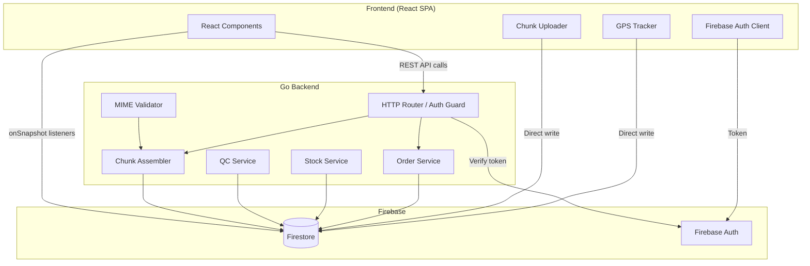
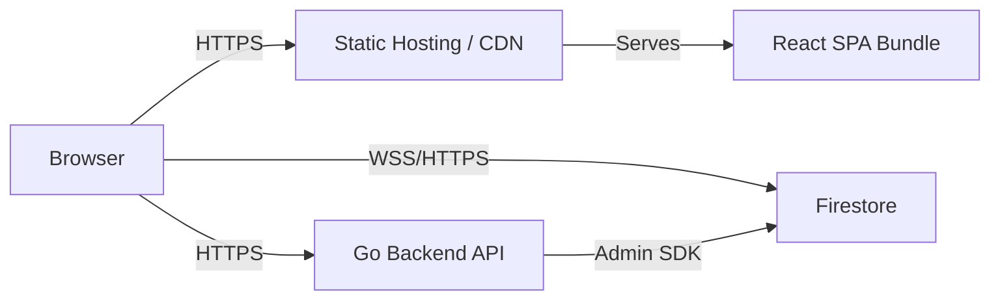
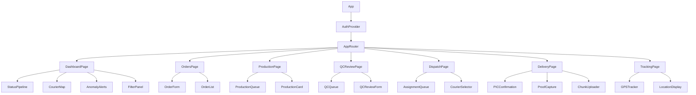
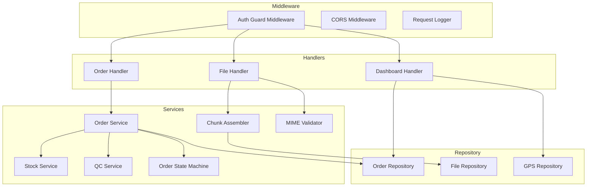
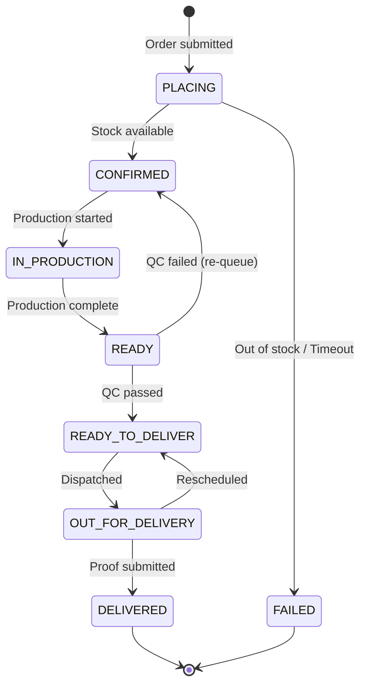
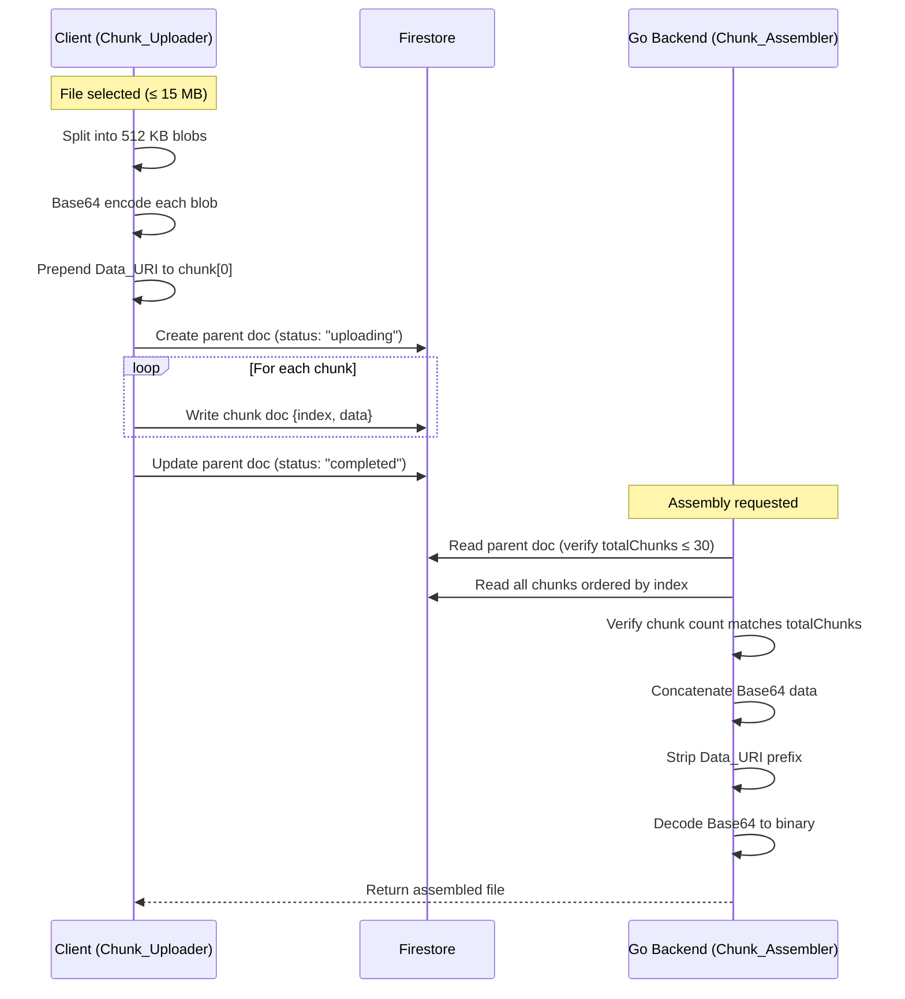
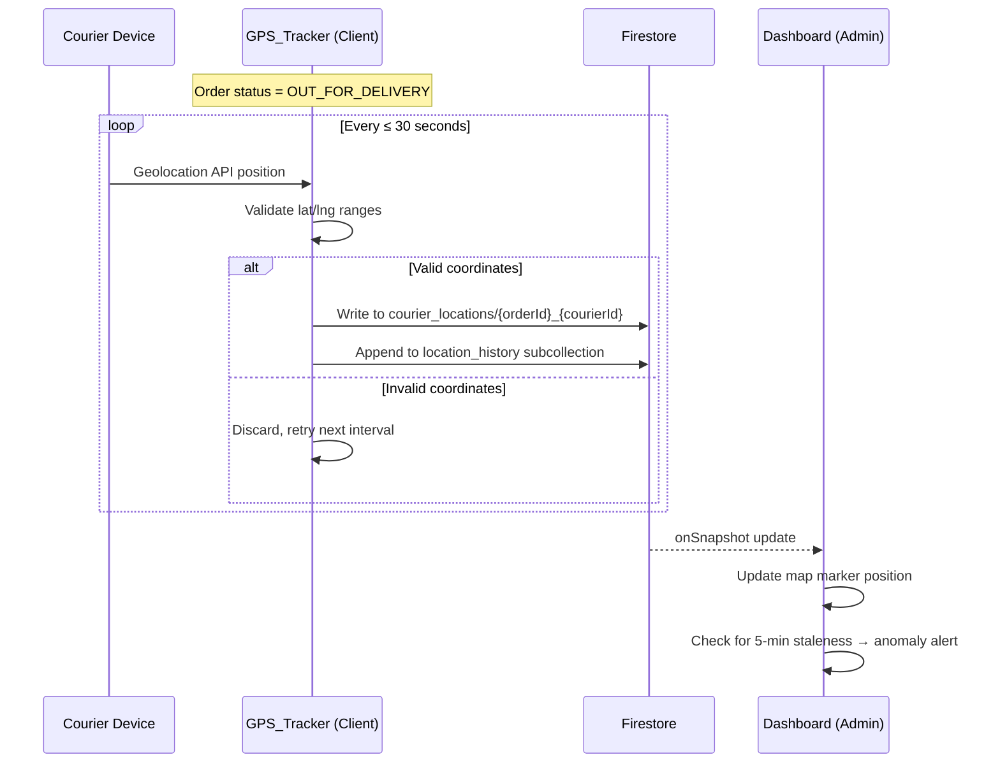
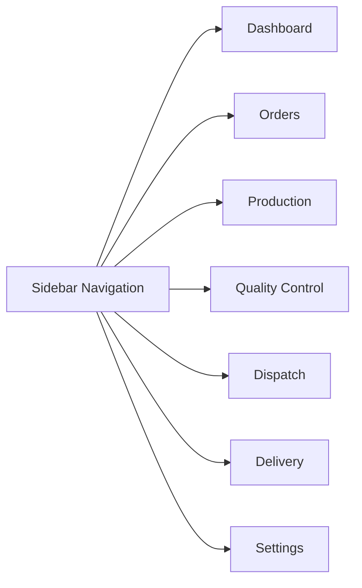
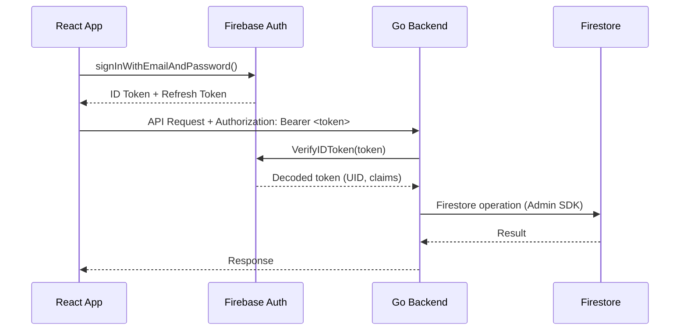
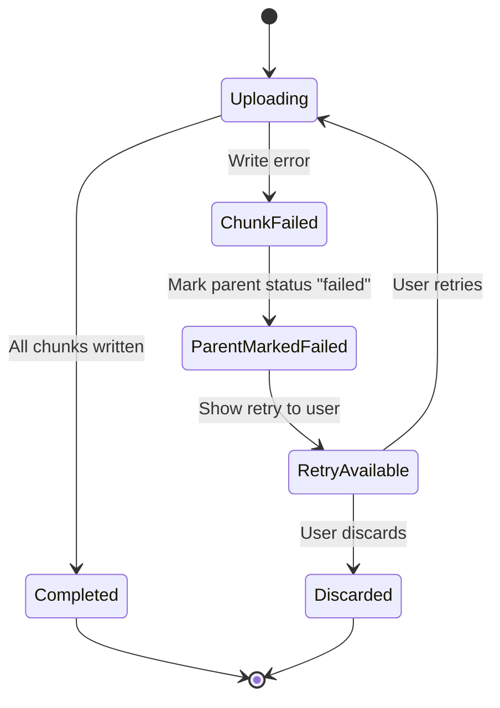

# Design Document: Order Fulfillment & Delivery Tracking System

## Overview

The Order Fulfillment & Delivery Tracking System is a full-stack web application for Al-Umana Koperasi that manages the complete order lifecycle — from placement through production, quality control, courier dispatch, GPS-tracked delivery, and formal handover (serah-terima) with digital proof capture. The system provides real-time monitoring for administrators via a live dashboard.

### Key Design Goals

- **Real-time visibility**: Firestore `onSnapshot` listeners power live updates across the dashboard, production queue, and GPS map without page refreshes.
- **Reliable file storage**: A Base64 chunking protocol stores proof-of-delivery files (photos, signatures) directly in Firestore, avoiding Firebase Cloud Storage.
- **Strict state machine**: Order status transitions are enforced server-side in the Go backend, preventing invalid state changes.
- **Security-first**: Firebase Authentication guards all endpoints and Firestore rules; CORS is locked to explicit origins in production.
- **Warm, professional UI**: A golden-yellow and dark-navy design system with Manrope/Hanken Grotesk typography delivers a clean, accessible interface.

### Tech Stack Summary

| Layer | Technology |
|-------|-----------|
| Frontend | React 18, TypeScript, Vite, Tailwind CSS v4 (@tailwindcss/vite) |
| UI Libraries | Radix UI, Material UI (MUI v7), Lucide React, Motion |
| Backend | Go 1.24, net/http (standard router), Firestore Admin SDK |
| Database | Firebase Firestore |
| Auth | Firebase Authentication |

---

## Architecture

### High-Level Architecture Diagram



### Communication Patterns

1. **Client → Go Backend**: REST API calls over HTTPS with Firebase ID token in `Authorization: Bearer <token>` header.
2. **Client → Firestore (direct)**: GPS coordinate writes and chunk uploads use the Firestore client SDK directly (authenticated via Firebase Auth).
3. **Firestore → Client (real-time)**: `onSnapshot` listeners push order status changes, GPS updates, and dashboard metrics to the UI.
4. **Go Backend → Firestore**: Server-side reads/writes using the Firestore Admin SDK (service account credentials).

### Deployment Architecture



---

## Components and Interfaces

### Frontend Component Hierarchy



### Frontend Services Layer

| Service | Responsibility |
|---------|---------------|
| `authService` | Firebase Auth sign-in/sign-out, token refresh, auth state listener |
| `orderService` | REST calls to Go backend for order CRUD and state transitions |
| `gpsService` | Geolocation API access, coordinate validation, Firestore direct writes |
| `chunkUploadService` | File splitting, Base64 encoding, Data_URI prefix, Firestore chunk writes |
| `realtimeService` | Firestore `onSnapshot` subscription management and cleanup |
| `dashboardService` | Aggregation queries, filter logic, anomaly detection |

### Go Backend API Endpoints

| Method | Path | Handler | Description |
|--------|------|---------|-------------|
| POST | `/api/orders` | `CreateOrder` | Validate and create a new order |
| GET | `/api/orders` | `ListOrders` | List orders with optional status/date filters |
| GET | `/api/orders/{id}` | `GetOrder` | Get single order details |
| PATCH | `/api/orders/{id}/status` | `TransitionStatus` | Advance order through state machine |
| POST | `/api/orders/{id}/assign-courier` | `AssignCourier` | Assign courier to READY_TO_DELIVER order |
| POST | `/api/orders/{id}/dispatch` | `DispatchOrder` | Confirm dispatch, set OUT_FOR_DELIVERY |
| POST | `/api/orders/{id}/deliver` | `ConfirmDelivery` | Mark order DELIVERED with proof references |
| GET | `/api/orders/{id}/files` | `ListOrderFiles` | List proof-of-delivery file metadata |
| POST | `/api/files/{id}/assemble` | `AssembleFile` | Trigger chunk assembly for a file |
| GET | `/api/files/{id}/download` | `DownloadFile` | Assemble and return file binary |
| POST | `/api/files/validate-mime` | `ValidateMIME` | Validate file MIME type before upload |
| GET | `/api/dashboard/stats` | `GetDashboardStats` | Aggregated order counts by status |
| GET | `/api/couriers/locations` | `GetCourierLocations` | Current GPS positions for active couriers |

### Go Backend Internal Components



---

## Data Models

### Firestore Collections Schema

#### `orders` Collection

```typescript
interface Order {
  id: string;                    // Auto-generated document ID
  customerId: string;            // Firebase Auth UID of the ordering client
  customerName: string;          // Display name (≤ 200 chars)
  items: OrderLineItem[];        // Array of line items
  deliveryAddress: string;       // Delivery address (≤ 500 chars)
  status: OrderStatus;           // Current status in the pipeline
  rejectionReason?: string;      // Reason if FAILED
  outOfStockItems?: string[];    // Item IDs that were out of stock
  assignedCourierId?: string;    // Courier UID when assigned
  productionStartedBy?: string;  // UID of production team member
  productionStartedAt?: string;  // ISO 8601 timestamp
  qcReviewedBy?: string;         // UID of QC reviewer
  qcReviewedAt?: string;         // ISO 8601 timestamp
  qcFailReason?: string;         // Reason if QC failed
  deliveredAt?: string;          // ISO 8601 timestamp of delivery
  proofFileIds?: string[];       // References to delivery_files documents
  createdAt: string;             // ISO 8601 server timestamp
  updatedAt: string;             // ISO 8601 server timestamp
}

interface OrderLineItem {
  itemId: string;                // Product identifier
  itemName: string;              // Display name
  quantity: number;              // Positive integer ≥ 1
}

type OrderStatus =
  | 'PLACING'
  | 'CONFIRMED'
  | 'IN_PRODUCTION'
  | 'READY'
  | 'READY_TO_DELIVER'
  | 'OUT_FOR_DELIVERY'
  | 'DELIVERED'
  | 'FAILED';
```

#### `courier_locations` Collection

```typescript
interface CourierGPS {
  orderId: string;       // Order being delivered
  courierId: string;     // Firebase Auth UID of courier
  latitude: number;      // -90 to 90
  longitude: number;     // -180 to 180
  timestamp: string;     // ISO 8601 server timestamp
}
```

Document ID pattern: `{orderId}_{courierId}` (latest location per order-courier pair, with a `location_history` subcollection for historical points).

#### `delivery_files` Collection

```typescript
interface FileMetadata {
  id: string;            // Auto-generated document ID
  orderId: string;       // Associated order
  fileName: string;      // Original file name
  fileSize: number;      // Size in bytes
  fileType: string;      // MIME type (image/jpeg, image/png, application/pdf)
  totalChunks: number;   // Expected chunk count
  status: 'uploading' | 'completed' | 'failed';
  uploadedBy: string;    // Firebase Auth UID
  createdAt: string;     // ISO 8601 timestamp
}
```

#### `delivery_files/{parentId}/chunks` Subcollection

```typescript
interface FileChunk {
  fileId: string;        // Parent document ID
  index: number;         // 0-based sequential index
  data: string;          // Base64 encoded data (chunk 0 includes Data_URI prefix)
}
```

#### `inventory` Collection (referenced by Stock_Service)

```typescript
interface InventoryItem {
  itemId: string;        // Product identifier
  itemName: string;      // Display name
  availableQty: number;  // Current available quantity
  updatedAt: string;     // ISO 8601 timestamp
}
```

### Order State Machine



#### Valid State Transitions Table

| From | To | Trigger | Actor |
|------|----|---------|-------|
| PLACING | CONFIRMED | All items in stock | System (Stock_Service) |
| PLACING | FAILED | Out of stock / timeout | System (Stock_Service) |
| CONFIRMED | IN_PRODUCTION | Production started | Production team member |
| IN_PRODUCTION | READY | Production complete | Production team member |
| READY | READY_TO_DELIVER | QC passed | QC reviewer |
| READY | CONFIRMED | QC failed | QC reviewer |
| READY_TO_DELIVER | OUT_FOR_DELIVERY | Dispatched | Dispatcher |
| OUT_FOR_DELIVERY | READY_TO_DELIVER | Rescheduled | Dispatcher/Admin |
| OUT_FOR_DELIVERY | DELIVERED | Proof submitted | Courier |

### Chunking Protocol Flow



### GPS Tracking Architecture



---

## UI/UX Design System

### Color Palette

| Token | Hex | Usage |
|-------|-----|-------|
| Primary | `#FBBF24` | CTAs, active states, highlights, progress indicators |
| Secondary | `#111827` | Headers, primary text, dark backgrounds |
| Tertiary | `#F59E0B` | Warnings, hover states, accent elements |
| Neutral | `#6B7280` | Body text, borders, disabled states |
| Background | `#F3F4F6` | Page background, card backgrounds |
| Success | `#10B981` | Delivered status, QC pass indicators |
| Error | `#EF4444` | Failed status, validation errors, anomaly alerts |
| Info | `#3B82F6` | GPS markers, informational badges |

### Typography

| Role | Font Family | Weight | Size |
|------|-------------|--------|------|
| H1 | Manrope | 700 (Bold) | 2rem (32px) |
| H2 | Manrope | 700 (Bold) | 1.5rem (24px) |
| H3 | Manrope | 600 (SemiBold) | 1.25rem (20px) |
| Body | Hanken Grotesk | 400 (Regular) | 1rem (16px) |
| Body Small | Hanken Grotesk | 400 (Regular) | 0.875rem (14px) |
| Label | Hanken Grotesk | 500 (Medium) | 0.75rem (12px) |
| Button | Hanken Grotesk | 600 (SemiBold) | 0.875rem (14px) |

### Component Design Tokens

#### Buttons

| Variant | Background | Text | Border | Hover |
|---------|-----------|------|--------|-------|
| Primary | `#FBBF24` | `#111827` | none | `#F59E0B` |
| Secondary | `#111827` | `#FFFFFF` | none | `#1F2937` |
| Inverted | `#111827` | `#FFFFFF` | none | `#374151` |
| Outlined | transparent | `#111827` | `1px solid #111827` | `#F3F4F6` bg |
| Danger | `#EF4444` | `#FFFFFF` | none | `#DC2626` |

All buttons: `border-radius: 9999px` (pill shape), `padding: 0.5rem 1.5rem`, `font-family: Hanken Grotesk`, `font-weight: 600`.

#### Cards

- Background: `#FFFFFF`
- Border radius: `1rem` (16px)
- Shadow: `0 1px 3px rgba(0,0,0,0.1), 0 1px 2px rgba(0,0,0,0.06)`
- Padding: `1.5rem`

#### Inputs

- Border radius: `9999px` (pill shape for search), `0.5rem` (8px for form fields)
- Border: `1px solid #D1D5DB`
- Focus ring: `2px solid #FBBF24`
- Padding: `0.75rem 1rem`

#### Navigation Tabs

- Pill-shaped tabs with `border-radius: 9999px`
- Active: `background: #FBBF24`, `color: #111827`
- Inactive: `background: transparent`, `color: #6B7280`

#### Status Badges

| Status | Background | Text |
|--------|-----------|------|
| PLACING | `#FEF3C7` | `#92400E` |
| CONFIRMED | `#DBEAFE` | `#1E40AF` |
| IN_PRODUCTION | `#E0E7FF` | `#3730A3` |
| READY | `#D1FAE5` | `#065F46` |
| READY_TO_DELIVER | `#FDE68A` | `#78350F` |
| OUT_FOR_DELIVERY | `#BFDBFE` | `#1E3A8A` |
| DELIVERED | `#A7F3D0` | `#064E3B` |
| FAILED | `#FEE2E2` | `#991B1B` |

### Page Layouts

#### Navigation Structure



- **Desktop**: Fixed left sidebar (240px width) with icon + label navigation items
- **Mobile**: Bottom tab bar with 5 primary items, hamburger menu for secondary items
- **Responsive breakpoint**: 768px (md)

#### Dashboard Layout

```
┌─────────────────────────────────────────────────────┐
│  Header: "Dashboard" + Date Range Filter            │
├─────────────────────────────────────────────────────┤
│  ┌─────┐ ┌─────┐ ┌─────┐ ┌─────┐ ┌─────┐ ┌─────┐ │
│  │Count│ │Count│ │Count│ │Count│ │Count│ │Count│ │  ← Status cards
│  └─────┘ └─────┘ └─────┘ └─────┘ └─────┘ └─────┘ │
├─────────────────────────────────────────────────────┤
│  ┌──────────────────────┐ ┌──────────────────────┐  │
│  │                      │ │                      │  │
│  │    Courier Map       │ │   Anomaly Alerts     │  │
│  │    (GPS Markers)     │ │   (Live Feed)        │  │
│  │                      │ │                      │  │
│  └──────────────────────┘ └──────────────────────┘  │
├─────────────────────────────────────────────────────┤
│  Filter Bar: Status | Courier | Date Range          │
│  ┌─────────────────────────────────────────────────┐│
│  │  Order Table (sortable, paginated)              ││
│  └─────────────────────────────────────────────────┘│
└─────────────────────────────────────────────────────┘
```

#### Delivery/Proof Capture Flow

```
Step 1: PIC Confirmation     Step 2: Photo Capture     Step 3: Signature     Step 4: Upload
┌──────────────────┐        ┌──────────────────┐     ┌──────────────────┐  ┌──────────────────┐
│  "Is PIC present?"│        │  Camera / Gallery │     │  Signature Pad   │  │  Upload Progress │
│                  │        │                  │     │                  │  │  ████████░░ 80%  │
│  [Confirm] [Back]│        │  [Capture] [Skip]│     │  [Clear] [Done]  │  │  [Retry if fail] │
└──────────────────┘        └──────────────────┘     └──────────────────┘  └──────────────────┘
```

---

## Security Architecture

### Authentication Flow



### Auth Guard Middleware (Go)

- Extracts `Authorization: Bearer <token>` from request headers
- Verifies token via Firebase Admin SDK `auth.VerifyIDToken()`
- Injects decoded UID and custom claims into request context
- Returns `401 Unauthorized` if token is missing or invalid

### CORS Configuration

- Production: Explicit allowlist of frontend origin domains
- Development: `localhost:5173` (Vite dev server)
- No wildcard (`*`) origins in production
- Allowed methods: `GET, POST, PATCH, DELETE, OPTIONS`
- Allowed headers: `Authorization, Content-Type`

### Firestore Security Rules Structure

```
rules_version = '2';
service cloud.firestore {
  match /databases/{database}/documents {
    // Default deny all
    match /{document=**} {
      allow read, write: if false;
    }

    // Orders: authenticated users can read their own, admins can read all
    match /orders/{orderId} { ... }

    // Courier locations: authenticated couriers write, admins read
    match /courier_locations/{docId} { ... }

    // Delivery files: authenticated users only
    match /delivery_files/{fileId} {
      allow read, write: if request.auth != null;
      match /chunks/{chunkId} {
        allow read, write: if request.auth != null;
      }
    }

    // Inventory: read-only for authenticated users
    match /inventory/{itemId} { ... }
  }
}
```

### MIME Validation Strategy

1. Client-side: Check `file.type` before upload (fast feedback)
2. Backend: Read file magic bytes to verify actual content type matches declared MIME
3. Accepted types: `image/jpeg`, `image/png`, `application/pdf`
4. Reject with `415` if mismatch, `413` if size > 10 MB

---

## Correctness Properties

*A property is a characteristic or behavior that should hold true across all valid executions of a system — essentially, a formal statement about what the system should do. Properties serve as the bridge between human-readable specifications and machine-verifiable correctness guarantees.*

### Property 1: Order validation accepts valid inputs and rejects invalid inputs with field-specific errors

*For any* order payload, the Order_Service validation SHALL accept the payload if and only if all required fields are valid (customer name is non-empty and ≤ 200 chars, each item identifier is non-empty, each quantity is a positive integer ≥ 1, delivery address is non-empty and ≤ 500 chars). For any invalid payload, the error response SHALL identify each failing field by name with a specific reason, and no order record SHALL be created.

**Validates: Requirements 1.1, 1.2**

### Property 2: Stock check determines order outcome

*For any* valid order that passes validation, if the Stock_Service reports all line items as available, the order status SHALL transition to `CONFIRMED`; if the Stock_Service reports any line item as unavailable, the order status SHALL transition to `FAILED` with all out-of-stock item identifiers recorded as the rejection reason.

**Validates: Requirements 1.4, 1.5, 1.6**

### Property 3: Valid order persistence with initial status

*For any* order payload that passes validation, the Order_Service SHALL persist the order in Firestore with status `PLACING` and all submitted field values preserved exactly.

**Validates: Requirements 1.3**

### Property 4: State machine rejects invalid transitions

*For any* order in status S and any transition attempt to status T, if (S → T) is not in the valid transitions table, the Order_Service SHALL reject the action with an invalid state transition error and leave the order status unchanged.

**Validates: Requirements 2.6, 2.7, 3.6, 4.5, 2.4, 4.4**

### Property 5: Production queue shows only CONFIRMED orders in creation order

*For any* set of orders with mixed statuses, the Production_Queue SHALL return only orders with status `CONFIRMED`, ordered by `createdAt` ascending.

**Validates: Requirements 2.1**

### Property 6: Production start records actor and timestamp

*For any* order in `CONFIRMED` status and any authenticated team member, starting production SHALL transition the order to `IN_PRODUCTION` and record the team member's UID and a server-side start timestamp.

**Validates: Requirements 2.2**

### Property 7: QC decision transitions and metadata

*For any* order in `READY` status and any QC decision (pass or fail with valid reason ≤ 500 chars), the Order_Service SHALL transition the order to `READY_TO_DELIVER` (pass) or `CONFIRMED` (fail with reason persisted), and SHALL record the reviewer's UID and a server-side timestamp.

**Validates: Requirements 3.2, 3.3, 3.4**

### Property 8: QC fail reason validation

*For any* QC fail decision where the reason is empty or exceeds 500 characters, the Order_Service SHALL reject the decision with a validation error and leave the order status unchanged.

**Validates: Requirements 3.5**

### Property 9: GPS coordinate validation and storage

*For any* GPS coordinate pair, if latitude is within [-90, 90] and longitude is within [-180, 180], the GPS_Tracker SHALL store the coordinate with latitude, longitude, and a server-side timestamp. If either value is outside its valid range, the GPS_Tracker SHALL discard the coordinate without writing a record.

**Validates: Requirements 5.4, 5.5**

### Property 10: GPS staleness detection

*For any* courier GPS record, if the time elapsed since the last update exceeds 5 minutes and the associated order has status `OUT_FOR_DELIVERY`, the system SHALL flag the record as anomalous. When a fresh valid update arrives, the anomaly flag SHALL be cleared.

**Validates: Requirements 5.3, 5.6, 9.4**

### Property 11: Chunking protocol round-trip

*For any* valid file (≤ 15 MB, accepted MIME type), splitting into ≤ 512 KB chunks, Base64 encoding, prepending Data_URI to chunk 0, writing to Firestore, then assembling by concatenating chunks in index order, stripping the Data_URI prefix, and decoding Base64 SHALL produce binary output identical to the original file.

**Validates: Requirements 7.2, 7.3, 7.4, 7.8, 7.9**

### Property 12: Chunk structure invariants

*For any* file accepted by the Chunk_Uploader, every chunk SHALL be ≤ 524,286 bytes of Base64 data, chunk indices SHALL be sequential starting from 0, chunk 0 SHALL begin with the Data_URI prefix `data:<fileType>;base64,`, and subsequent chunks SHALL NOT contain the Data_URI prefix.

**Validates: Requirements 7.2, 7.3, 7.4, 7.6**

### Property 13: File size rejection

*For any* file whose byte size exceeds 15,728,640 bytes, the Chunk_Uploader SHALL reject the file before any upload begins, and no partial documents SHALL exist in Firestore. For any file whose byte size exceeds 10,485,760 bytes at the backend validation layer, the MIME_Validator SHALL return a 413 response.

**Validates: Requirements 7.1, 8.6**

### Property 14: Assembly guard conditions

*For any* assembly request where the chunk count exceeds 30 or does not match the `totalChunks` value in the parent document, the Chunk_Assembler SHALL reject the request with an appropriate error without returning partial data.

**Validates: Requirements 7.10, 7.12**

### Property 15: MIME validation

*For any* file content, the MIME_Validator SHALL accept the file if and only if its magic bytes are consistent with `image/jpeg`, `image/png`, or `application/pdf`. For any file with inconsistent content, the validator SHALL return a 415 Unsupported Media Type response.

**Validates: Requirements 8.1, 8.2**

### Property 16: Auth guard rejects unauthenticated requests

*For any* request to a protected Go backend endpoint that lacks a valid Firebase Authentication token, the Auth_Guard SHALL return a 401 Unauthorized response.

**Validates: Requirements 8.4, 8.7**

### Property 17: Dashboard filter AND logic

*For any* combination of filter criteria (order status, courier identifier, date range ≤ 90 days) applied to any set of orders, the filtered results SHALL contain only orders that satisfy ALL selected criteria simultaneously.

**Validates: Requirements 9.5**

### Property 18: Proof capture validation

*For any* proof submission, the Proof_Capture SHALL accept the submission if and only if both a photo (JPEG or PNG) and a digital signature (containing at least one drawn stroke) are provided.

**Validates: Requirements 6.2**

---

## Error Handling

### Backend Error Response Format

All Go backend errors follow a consistent JSON structure:

```json
{
  "error": {
    "code": "VALIDATION_ERROR",
    "message": "Human-readable description",
    "details": [
      { "field": "customerName", "reason": "must not be empty" }
    ]
  }
}
```

### Error Categories

| Code | HTTP Status | Description |
|------|-------------|-------------|
| `VALIDATION_ERROR` | 400 | Request payload fails validation |
| `INVALID_STATE_TRANSITION` | 409 | Order cannot transition to requested status |
| `UNAUTHORIZED` | 401 | Missing or invalid Firebase auth token |
| `FORBIDDEN` | 403 | User lacks permission for the action |
| `NOT_FOUND` | 404 | Order or resource does not exist |
| `UNSUPPORTED_MEDIA_TYPE` | 415 | File MIME type not in accepted set |
| `PAYLOAD_TOO_LARGE` | 413 | File exceeds 10 MB backend limit |
| `TIMEOUT` | 504 | Stock service did not respond within 10s |
| `CHUNK_LIMIT_EXCEEDED` | 400 | File would produce > 30 chunks |
| `INCOMPLETE_DATA` | 400 | Chunk count mismatch during assembly |
| `DECODE_FAILURE` | 500 | Base64 decode failed during assembly |
| `UPLOAD_FAILED` | 500 | Chunk write to Firestore failed |

### Frontend Error Handling Strategy

1. **Network errors**: Retry with exponential backoff (max 3 attempts), then show offline indicator
2. **Validation errors (400)**: Display field-specific error messages inline
3. **Auth errors (401)**: Redirect to login, attempt token refresh first
4. **State transition errors (409)**: Show toast notification explaining the conflict, refresh order state
5. **Upload failures**: Retain local data, show retry button with failed file identification
6. **GPS errors**: Silently retry at next interval, log to console for debugging

### Chunk Upload Error Recovery



---

## Testing Strategy

### Dual Testing Approach

This system uses both unit/example-based tests and property-based tests for comprehensive coverage.

#### Property-Based Testing

**Library**: [fast-check](https://github.com/dubzzz/fast-check) for TypeScript frontend logic, and a Go PBT library (e.g., [rapid](https://github.com/flyingmutant/rapid)) for backend logic.

**Configuration**:
- Minimum 100 iterations per property test
- Each property test references its design document property
- Tag format: `Feature: order-fulfillment-delivery-tracking, Property {number}: {property_text}`

**Properties to implement**:
- Property 1: Order validation (fast-check — generate random payloads)
- Property 2: Stock check outcome (rapid — mock stock service)
- Property 3: Order persistence (rapid — verify Firestore writes)
- Property 4: State machine guards (rapid — generate all invalid transitions)
- Property 5: Production queue filtering (fast-check — generate mixed-status order sets)
- Property 6: Production start metadata (rapid)
- Property 7: QC decision transitions (rapid)
- Property 8: QC fail reason validation (rapid — generate edge-case strings)
- Property 9: GPS coordinate validation (fast-check — generate random lat/lng)
- Property 10: GPS staleness detection (fast-check — generate random timestamps)
- Property 11: Chunking round-trip (fast-check — generate random binary data)
- Property 12: Chunk structure invariants (fast-check — generate random files)
- Property 13: File size rejection (fast-check — generate random sizes)
- Property 14: Assembly guard conditions (rapid — generate mismatched chunk counts)
- Property 15: MIME validation (rapid — generate random file headers)
- Property 16: Auth guard (rapid — generate requests without tokens)
- Property 17: Dashboard filter AND logic (fast-check — generate random filter combos)
- Property 18: Proof capture validation (fast-check — generate partial submissions)

#### Unit/Example-Based Tests

- Stock service timeout handling (Requirement 1.7)
- PIC confirmation gate (Requirement 6.1)
- Upload failure retry flow (Requirement 6.5)
- Dashboard real-time subscription setup (Requirement 9.1)
- Reschedule anomaly alert (Requirement 9.3)
- Courier assignment queue display (Requirement 4.1)

#### Integration Tests

- Firestore onSnapshot latency (Requirements 3.1, 5.2, 9.2)
- GPS write interval verification (Requirement 5.1)
- End-to-end order lifecycle (all status transitions)
- Firestore security rules (Requirements 8.3, 10.2)
- QC notification delivery (Requirement 2.5)
- Chunk upload to Firestore (Requirement 6.3)

#### Smoke Tests

- CORS configuration (Requirement 8.5)
- .gitignore patterns (Requirement 10.1)
- Firestore rules structure (Requirement 10.3)
- Repository secret scan (Requirement 10.4)
- TypeScript interface definitions (Requirements 11.1–11.5)

### Test Organization

```
frontend/
  src/
    __tests__/
      properties/          # fast-check property tests
        order-validation.property.test.ts
        chunk-roundtrip.property.test.ts
        gps-validation.property.test.ts
        filter-logic.property.test.ts
        staleness.property.test.ts
      unit/                # Example-based unit tests
        order-form.test.ts
        proof-capture.test.ts
        chunk-uploader.test.ts
      integration/         # Firestore emulator tests
        realtime.test.ts
        security-rules.test.ts

backend/
  internal/
    order/
      order_test.go        # Unit + property tests for order service
      statemachine_test.go # Property tests for state machine
    file/
      chunker_test.go      # Property tests for chunk assembly
      mime_test.go         # Property tests for MIME validation
    auth/
      guard_test.go        # Property tests for auth guard
```

### Test Environment

- **Frontend**: Vitest with fast-check, Firebase Emulator Suite for integration tests
- **Backend**: Go testing package with rapid, Firestore emulator for integration tests
- **CI**: Run all property tests (100+ iterations) and unit tests on every PR
- **Pre-commit**: Run fast unit tests only (skip property tests for speed)

