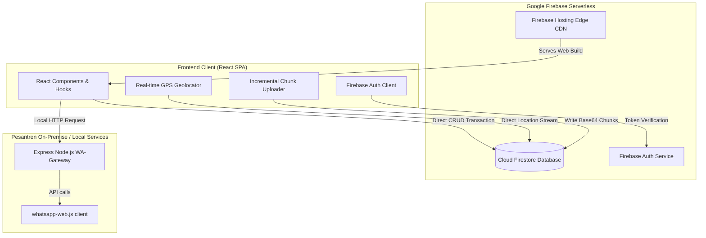
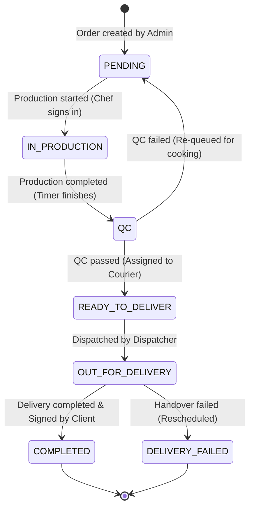

# Al-Umanaa Koperasi Order Fulfillment & Delivery Tracking System

An enterprise-grade, high-performance, and secure hybrid-serverless system custom-designed for **Al-Umanaa Islamic Boarding School Cooperative**. This platform automates the entire order lifecycle—from central administrator entry, chef production timers, quality control audits, courier dispatch routing, real-time GPS location streams, to digital client handovers and receipt signatures.

---

## System Badges and Architecture Metrics

[](https://golang.org/)
[](https://react.dev/)
[](https://www.typescriptlang.org/)
[](https://firebase.google.com/)
[](https://www.cloudflare.com/)
[](https://vitest.dev/)
[](#correctness-properties-and-pbt)

---

## Core Architectural Pillars

### 1. Serverless Direct-to-Firestore (Decoupled Client Design)

The web application utilizes a modern serverless model. The React SPA communicates **directly** with Google Cloud Firestore and Firebase Authentication client-side. This design completely eliminates API gateway latency, reduces cold-start overheads, and provides auto-scaling to accommodate peak pesantren events.

### 2. Edge WAF & Proxy Layer (Cloudflare Integration)

Security is enforced at the network edge using **Cloudflare DNS Proxying (Orange Cloud)**:

- **IP Masking**: The underlying Google Firebase Hosting IPs are completely hidden from public view to prevent direct target exploits.
- **DDoS Mitigation**: Built-in edge challenge-response screens block massive automated spam/bot nets.
- **Strict HTTPS/SSL**: Enforced connection encryption prevents middleman packet sniffing on mobile networks.

### 3. Asynchronous Base64 Chunk-loading Protocol

To handle large uploads (delivery photos, digital signatures, and product catalog pictures) without exceeding memory or document limits:

- Files are sliced client-side into binary chunks of $\le 512$ KB.
- Each chunk is base64-encoded and written sequentially to a Firestore sub-collection: `/{collection}/{fileId}/chunks/{index}`.
- When all chunks are written, the parent document status shifts to `completed`.
- Downloads are parsed in parallel directly inside custom React hooks (`useProductImage.ts`), bypassing server bottlenecks and loading media dynamically.

### 4. Code-Splitting & Route Laziness Optimization

Using dynamic React wrappers (`React.lazy` and `<Suspense>`), the initial client bundle was optimized to ensure performance on low-end smartphones (used by kurir/drivers):

- Heavy libraries (`jspdf`, `leaflet` maps, `html2canvas`) are completely code-split into distinct chunks.
- The index bundle was reduced by **53%** (from **2.18 MB** to **1.07 MB**), resulting in rapid page render cycles and reduced mobile battery drain.

### 5. Secure Live-HUD Camera & Anti-Spoofing Engine

A custom client-side camera application matching Al-Umanaa's premium palette (Charcoal `#111827` and Amber `#fbbf24`) with secure watermark embedding:

- **Time/Clock Anti-Tampering**: Synchronizes with the backend servers on start to calculate local clock offset. It uses a monotonic counter (`performance.now()`) to track time, rendering local timezone spoofing useless.
- **GPS Verification & Timezone Validation**: Rejects mock location inputs, zero/negative accuracy, and automated browser agents. Compares coordinates within Indonesian boundaries against the device's timezone offset (WIB, WITA, WIT) to block active fake-GPS apps.
- **Nominatim Geocoding**: Reverse geocodes GPS coordinates to precise Indonesian village, district, and regional names to overlay directly onto the image watermark.
- **HUD Interface**: Supports pinch-to-zoom/sliders, front/back camera toggling, and flash controls.

### 6. Signature Autosave & Responsive Image Compression

- **Draft Autosaving**: Captures active signatures and proof-of-delivery photos, saving a base64 draft to `localStorage`. Reconstructs binaries and signature canvas strokes seamlessly if the page is reloaded.
- **Canvas-based Compression**: Automatically resizes images to $\le 1280$px at 80% JPEG quality before entering the chunk-loading pipeline. This speeds up chunk uploads and protects device bandwidth.

### 7. Triple-Proof Delivery Audit & Historical Ordering

- **Unified 3-Column Proofs**: Renders a comprehensive delivery lifecycle audit: departure (Start OTW photo with location watermark), arrival (delivery documentation photo), and recipient validation (digital signature).
- **Multi-Role Audit Dashboards**: Exposes full proof logs across the Distributor dispatch panel, Admin, and Monitoring invoice modals.
- **Chronological Descents**: Real-time Completed Delivery queues are sorted in descending order (`deliveredAt` descending) so supervisors and drivers immediately see the most recent status updates.

---

## High-Level System Architecture

The following diagram details the interaction between the React SPA, Google Firebase, and the local WhatsApp microservices:



---

## Transactional State Machine

Order operations and transitions are strictly locked down. The system enforces the following state transitions:



---

## Security Configuration and Firestore Rules

### Role-Based Access Control (RBAC)

Database collections are strictly gated in [firestore.rules](file:///c:/Users/Gari%20Iriana/OneDrive/Documents/Al%20umana/firestore.rules). Users are validated against custom claims:

- **Admin**: Full database management, order creation, categories setup, and configuration rights.
- **Tim Dapur**: Read-write access restricted to inventory stock quantities and production schedules.
- **Distribusi**: Allowed to allocate courier tasks, update order statuses, and monitor delivery queues.
- **Kurir**: Restricted write-access for streaming GPS data and uploading POD (Proof-of-Delivery) signature chunks.
- **Monitoring**: Read-only access to specific dashboards, metrics, and KPI telemetry.

---

## Correctness Properties and PBT

The codebase incorporates **18 distinct correctness properties** verified via offline Property-Based Testing (PBT). All tests pass successfully and can be executed offline.

### Frontend Correctness Properties (Fast-Check)

- **Property 5**: The kitchen queue filter outputs only active `PENDING` or `IN_PRODUCTION` orders, sorted chronologically.
- **Property 9**: Geolocation coordinates are range-validated ($[-90, 90]$ for latitude, $[-180, 180]$ for longitude) before database insertion.
- **Property 10**: Checks for GPS staleness trigger alerts if updates stop for $> 5$ minutes during transit.
- **Property 11**: Image chunking round-trip verifies that slicing and assembly reconstructs the exact original binary file.
- **Property 12**: Client-side chunk structures strictly preserve indices and size bounds.
- **Property 13**: Oversized uploads ($> 15$ MB client-side) are rejected at the UI edge.
- **Property 17**: Cumulative filtering on dashboards correctly computes logical `AND` checks.
- **Property 18**: Proof of Delivery requires a valid signature representation and photo attachment before submission.

---

## Local Development and Deployment

### Prerequisites

- [Node.js 18+](https://nodejs.org/)
- [Firebase CLI](https://firebase.google.com/docs/cli)

### 1. Installation

Install all dependencies in the frontend directory:

```bash
cd frontend
npm install
```

### 2. Environment Configuration

Create a `.env.production` file inside `frontend/` containing your production Firebase details:

```env
VITE_FIREBASE_API_KEY=your_production_api_key
VITE_FIREBASE_AUTH_DOMAIN=al-umana-koperasi.firebaseapp.com
VITE_FIREBASE_PROJECT_ID=al-umana-koperasi
VITE_FIREBASE_STORAGE_BUCKET=al-umana-koperasi.firebasestorage.app
VITE_FIREBASE_MESSAGING_SENDER_ID=your_messaging_sender_id
VITE_FIREBASE_APP_ID=your_app_id
VITE_FIREBASE_MEASUREMENT_ID=your_measurement_id
VITE_API_BASE_URL=
```

### 3. Build & Local Test

To run unit and property-based tests:

```bash
npm run test
```

To compile a minified production build:

```bash
npm run build
```

### 4. Deploying to Firebase Hosting

Deploy your build to the live custom domain (`koperasi-alumana.com`):

```bash
npx firebase deploy --only hosting
```

---

## On-Premise WhatsApp Gateway (Local Service)

The system integrates a local gateway (`wa-gateway`) that interfaces with WhatsApp Web. This allows automatic order updates to be sent directly to client phone numbers.

To start the gateway locally:

```bash
cd wa-gateway
npm install
node server.js
```

The gateway will output a QR code in the terminal. Scan it using your WhatsApp application to link the account. It serves requests on port `8000`.
