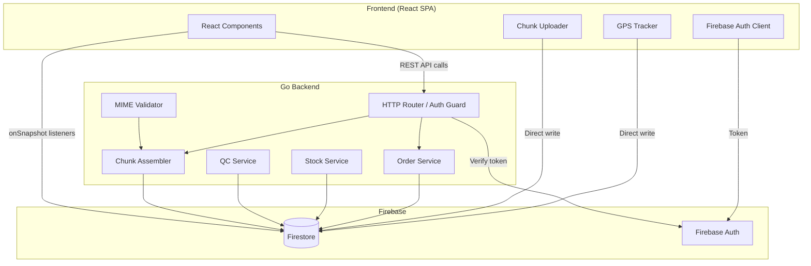
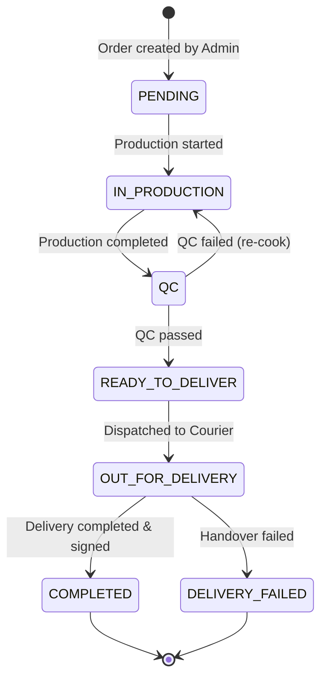

# Al-Umanaa Koperasi Order Fulfillment & Delivery Tracking System

[](https://golang.org/)
[](https://react.dev/)
[](https://tailwindcss.com/)
[](https://firebase.google.com/)
[](#correctness-properties-and-pbt)

The **Order Fulfillment & Delivery Tracking System** is a secure, full-stack enterprise web application built for **Al-Umanaa Koperasi**. It automates and manages the entire order lifecycle—from placement through production, quality control, dispatch, real-time GPS-tracked delivery, and formal handover with digital proof uploads.

---

## Pembaruan Fitur Sistem Koperasi (Upgraded Features)

### 1. Manajemen Peran & Pengguna Internal (RBAC)
- **Akses Khusus Staf**: Sistem sepenuhnya beroperasi untuk 5 peran internal: **Admin (Super Admin)**, **Tim Dapur (Produksi)**, **Distribusi**, **Kurir**, dan **Monitoring**. Pendaftaran mandiri umum dan login Google dinonaktifkan demi keamanan.
- **Akses Terbatas Monitoring**: Peran Monitoring bersifat *read-only* (hanya memantau) untuk melihat performa pengiriman, KPI, keterlambatan, dan grafik performa tim tanpa hak mengubah data.

### 2. Alur Pesanan & Pembayaran Baru
- **Input Pesanan oleh Admin**: Pembuatan pesanan dilakukan sepenuhnya secara terpusat oleh Admin/Super Admin.
- **Penghapusan Bukti Bayar Manual**: Alur pengunggahan bukti bayar dan persetujuan transfer pelanggan telah dihapus sepenuhnya dari aplikasi.
- **Dua Jalur Status Independen**: 
  - **Status Operasional**: `Pending` ➔ `Produksi` ➔ `QC` ➔ `Siap Dikirim` ➔ `Dalam Pengiriman` ➔ `Selesai` / `Gagal`.
  - **Status Keuangan**: `Belum Dibayar` ➔ `Sudah Dibayar` ➔ `Jatuh Tempo` (otomatis 7 hari untuk Event, 1 bulan untuk Rutin).

### 3. Tautan Nota (Invoice Link) & Tanda Tangan Digital
- **Invoice Link WhatsApp**: Admin membagikan tautan nota unik kepada pelanggan melalui WhatsApp. Pelanggan membuka tautan untuk melihat rincian nota tanpa harus login.
- **Tanda Tangan Elektronik**: Pelanggan dapat membubuhkan tanda tangan penerimaan barang langsung di layar HP/tablet sebagai konfirmasi barang diterima.
- **Validasi Manual**: Jika pelanggan tidak menandatangani secara digital, Admin dapat memvalidasi secara manual dengan mengunggah bukti komunikasi alternatif (misalnya screenshot chat WhatsApp).

### 4. Manajemen Dapur & Distribusi
- **Stok & Menu oleh Tim Dapur**: Hak mengelola menu dan memperbarui stok bahan kini dialihkan langsung ke Tim Produksi (Dapur) agar sesuai dengan kapasitas dapur yang sebenarnya.
- **Jadwal Makanan Dapur**: Tim Dapur dapat mengatur jadwal menu harian asatidzah pesantren.
- **Multi-Order Courier Assignment**: Tim Distribusi dapat menugaskan satu kurir untuk membawa beberapa pesanan sekaligus dalam sekali perjalanan.
- **Delivery Scheduler**: Kalender pengiriman untuk memetakan tugas kurir harian dan mingguan guna mendeteksi serta mencegah konflik penugasan kurir (bentrok waktu < 2 jam).

---

## System Architecture

The following diagram illustrates the high-level architecture and data-flow across the React frontend, Go backend, and Google Firebase services:



---

## Order State Machine

Status transitions are strictly validated. The operational workflow is structured as follows:



---

## Data Models

The system defines the following schemas within Firestore:

### `orders` Collection

```typescript
interface Order {
  id: string;                    // Document ID (auto-generated)
  orderType: OrderType;          // 'event' | 'routine'
  institutionName: string;       // Name of ordering school / institution
  recipientName: string;         // Recipient PIC name
  recipientPhone: string;        // Recipient PIC phone number
  recipientNotes?: string;       // Delivery/handover details
  eventDate: string;             // Event date string
  deliveryAddress: string;       // Delivery address
  deliveryTime: string;          // Dispatch target time slot
  foodDetails: string;           // Cooking recipe/details
  drinkDetails: string;          // Beverage preparation details
  totalPrice: number;            // Computed grand total
  additionalNotes?: string;      // Optional admin guidelines
  paymentStatus: PaymentStatus;  // 'BELUM_DIBAYAR' | 'SUDAH_DIBAYAR' | 'JATUH_TEMPO'
  paymentDueDate: string;        // Automated calculated due date (ISO string)
  status: OrderStatus;           // 'PENDING' | 'IN_PRODUCTION' | 'QC' | 'READY_TO_DELIVER' | 'OUT_FOR_DELIVERY' | 'COMPLETED' | 'DELIVERY_FAILED'
  items: OrderLineItem[];        // Array of items quantity
  invoiceToken?: string;         // Shared unauthenticated invoice token
  invoiceSignedAt?: string;      // Handover signature timestamp
  invoiceSignatureData?: string; // Digital signature base64 canvas path
  manualValidation?: {           // Log if verified manually by admin
    screenshotFileIds: string[];
    contactPhone: string;
    notes: string;
    validatedBy: string;
    validatedAt: string;
  };
  assignedCourierId?: string;    // Courier ID assigned for delivery
  createdAt: string;             // ISO 8601 server timestamp
  updatedAt: string;             // ISO 8601 server timestamp
}
```

### `courier_locations` Collection

```typescript
interface CourierGPS {
  orderId: string;       // Order being delivered
  courierId: string;     // Firebase Auth UID of courier
  latitude: number;      // -90 to 90
  longitude: number;     // -180 to 180
  timestamp: string;     // ISO 8601 server timestamp
}
```

---

## Correctness Properties and PBT

The codebase integrates 18 distinct correctness properties verified via Property-Based Testing (PBT). All tests compile and run entirely offline with mock databases.

### Go Backend Properties (11 Tests)

- **Property 1**: Order validation accepts valid inputs and rejects invalid inputs with field-specific errors.
- **Property 2**: Stock allocation outcome determines order status (`CONFIRMED` vs `FAILED`).
- **Property 3**: Valid order persistence with initial `PLACING` status.
- **Property 4**: State machine rejects invalid transitions with a `409 Conflict`.
- **Property 6**: Production start records started-by UID and server-side timestamp.
- **Property 7**: QC decisions transition orders and record review metadata.
- **Property 8**: QC fail reasons are validated (empty or > 500 characters triggers error).
- **Property 14**: Chunk assembly checks sequential chunk sizes, indexes, and expected limits.
- **Property 15**: File MIME validation verifies binary magic bytes for JPEG, PNG, and PDF.
- **Property 16**: Auth guard rejects unauthenticated requests with a `401 Unauthorized`.

### React Frontend Properties (7 Tests)

- **Property 5**: Production queue filters only `CONFIRMED` orders sorted chronologically.
- **Property 9**: GPS Geolocation coordinates are range-validated before transmission.
- **Property 10**: GPS location staleness checks flag an anomaly when updates stall for > 5 mins.
- **Property 11**: End-to-end chunking round-trip verifies splitting and assembly reconstructs the identical binary file.
- **Property 12**: Client-side chunk structures strictly preserve sizes and data prefixes.
- **Property 13**: Oversized uploads (> 15 MB client-side, > 10 MB backend) are rejected.
- **Property 17**: Dashboard filters enforce cumulative `AND` logic for status, couriers, and date ranges.
- **Property 18**: Proof of Delivery capture enforces signature presence and photo attachment.

---

## Local Development Setup

### Prerequisites

- [Go 1.24+](https://golang.org/dl/)
- [Node.js 18+](https://nodejs.org/)

### 1. Backend Setup

```bash
cd backend
copy .env.example .env
go run ./cmd/server
```

To run Go property-based tests:

```bash
cd backend
go test -v ./...
```

### 2. Frontend Setup

```bash
cd frontend
copy .env.example .env
npm install
npm run dev
```

To run frontend property-based tests:

```bash
cd frontend
npm run test
```

---

## Running with Docker

This project includes a Docker setup supporting both development and production environments.

### Docker Prerequisites

- [Docker](https://docs.docker.com/get-docker/)
- [Docker Compose](https://docs.docker.com/compose/install/)

### 1. Development (with Hot-Reloading)

To run the entire stack (Go backend + React frontend) in development mode with automatic hot-reloading:

```bash
# Build and run the services in the background
docker compose up --build -d

# View live container logs
docker compose logs -f
```

- **Frontend** will be served at `http://localhost:5173`.
- **Backend** will be accessible at `http://localhost:8080`.
- Editing backend `.go` or frontend `.tsx` files locally will automatically trigger rebuilds inside the containers.

### 2. Production (Optimized)

To build and run optimized production containers (statically-compiled Go backend, Vite production build served via Nginx):

```bash
# Build and run in production mode
docker compose -f docker-compose.prod.yml up --build -d
```

- **Frontend** will be served on port `http://localhost:80`.
- **Backend** will be served on port `http://localhost:8080`.
