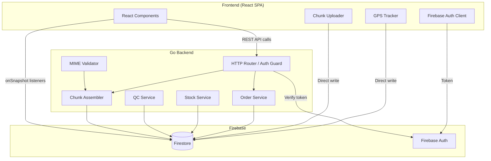
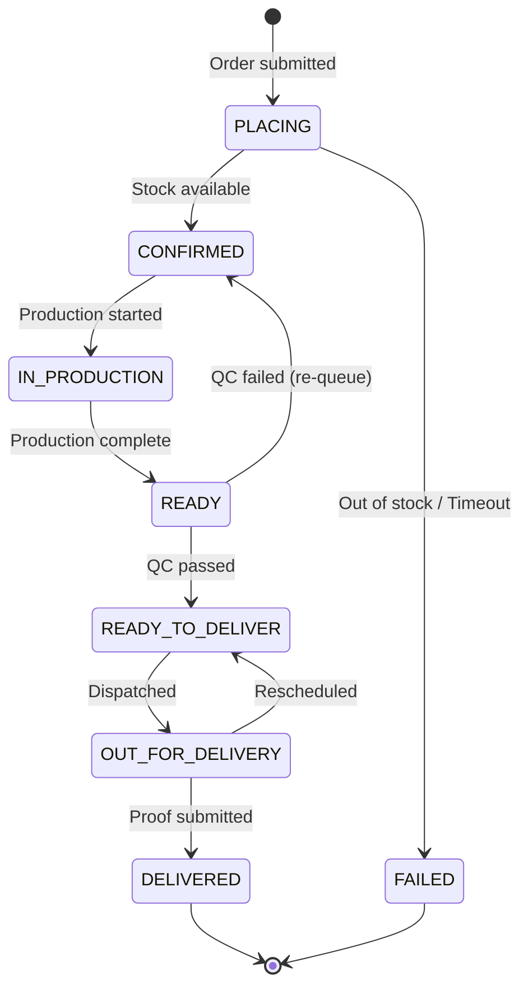

# Al-Umanaa Koperasi Order Fulfillment & Delivery Tracking System

[](https://golang.org/)
[](https://react.dev/)
[](https://tailwindcss.com/)
[](https://firebase.google.com/)
[](#correctness-properties-and-pbt)

The **Order Fulfillment & Delivery Tracking System** is a secure, full-stack enterprise web application built for **Al-Umanaa Koperasi**. It automates and manages the entire order lifecycle—from placement through production, quality control, dispatch, real-time GPS-tracked delivery, and formal handover with digital proof uploads.

---

## Premium Features (Upgraded)

### Cart Cleanup & Direct Checkout Isolation

- **Direct Checkout Isolation ("Beli Sekarang")**: Tapping "Beli Sekarang" dynamically bypasses the persistent shopping cart, preserving separate cart contents (e.g. buying 1 iced tea while keeping 3 fried rice items safe in the cart).
- **Instant Selective Cart Cleanup**: Upon placing a COD or transfer-proof order, the exact purchased items are instantly cleared from the Firestore database shopping cart, leaving unrelated items completely untouched.
- **Wizard Route State Retention**: Step-back and step-forward transitions (`/checkout/address` $\leftrightarrow$ `/checkout/payment`) preserve checkout items list and total pricing, preventing state resets.

### Multi-Image Product Gallery & Cascade Deletion

- **Foto Tambahan Widget**: Administrators can upload up to 5 detailed secondary product photos with active progress bars and chunk-resumable uploading.
- **Set Main (Jadikan Utama)**: Dynamic swap action instantly makes any secondary photo the primary display image.
- **Garbage collection (Cascade Purge)**: Deleting a product or a single detailed photo recursively purges the master document and all associated numbered chunks from Firestore (`product_images/{fileId}/chunks/*`) to prevent orphan file storage leaks.

### Dynamic Discount Pricing System

- **Backend-Validated Percentages**: Enforces a strict `[0, 100]` discount range in the Go backend and Firestore layers.
- **Live Markdown Formulas**: Storefront automatically displays computed original base price, dynamic discounted price, and premium red-coral discount badges (e.g. `-15%`).

### Premium Tabbed Orders History View (`/orders`)

- **Iconic Category Tabs**: Premium responsive tab bar divided into `Belum Bayar` (Wallet), `Dikemas` (Package), `Dikirim` (Truck), and `Beri Penilaian` (Star in circular outline).
- **Live Counter Badges**: Red notification circles displaying the dynamic count of active orders within each lifecycle stage.
- **Itemized Listing Layout**: Cards list every product row (with image thumbnail, item name, and exact quantity multiplier `× Qty`) inside the preview card, replacing generic text summaries.

### Smart Notification Center (`/notifications`)

- **Milestone Timeline Splits**: Separated cooking complete (`READY` - kitchen QC check) from dispatch readiness (`READY_TO_DELIVER` - ready for courier), fitting the 8-step tracking sequence.
- **Historical Milestone Logs**: Displays historical stages sequentially so older order updates are not overwritten when status advances.
- **Timestamp to ISO Parser**: Safely handles Firestore raw `Timestamp` objects, eliminating "Invalid Date" UI bugs.
- **Auto-Ticking Refresher**: Real-time interval timer triggers UI relative time recalculation (e.g. *"Baru saja"*, *"3 menit lalu"*) every 30 seconds.

### Responsive Desktop Account Sidebar

- **Synced Profile Avatar**: Sidebar menu header retrieves and renders the logged-in user's custom photo URL (Google Account Avatar / custom profile picture) with a graceful letter-badge fallback.

### 8-Step Cooking & Dispatch Tracking Stepper

- **Extended Order Stepper**: Fully interactive 8-step tracking timeline for customers:
  1. Pesanan Dibuat
  2. Persetujuan Pembayaran
  3. Proses Memasak
  4. Uji Kelayakan (QC)
  5. Siap Dikirim
  6. Dalam Pengantaran
  7. Pesanan Terkirim
  8. Selesai
- **Base64 Assembly Evidence**: Assembles and displays the kitchen's "Bukti Foto Mulai Memasak" photo on the customer tracking page in real-time.
- **Courier Dashboard Integrations**: Displays customer's delivery information card, phone contact link, and custom-templated WhatsApp dispatch shortcut button.

### Indonesian UMKM Dummy Seed Generator & Global Purge

- **Verified Photographic Seeds ("Muat UMKM")**: Seeds representative Sembako, Makanan, Minuman, and Camilan products with exact, verified food images from Wikimedia Commons.
- **Global Purge ("Hapus Semua")**: Clears the entire product catalog and cascade-deletes all associated image file chunks globally, resetting the demo presentation instantly.

---

## System Architecture

The following diagram illustrates the high-level architecture and data-flow across the React frontend, Go backend, and Google Firebase services:



---

## Order State Machine

Status transitions are strictly validated in the Go backend. Any invalid status transitions are rejected:



---

## Data Models

The system defines the following schemas within Firestore:

### `orders` Collection

```typescript
interface Order {
  id: string;                    // Document ID (auto-generated)
  customerId: string;            // Firebase Auth UID of the ordering client
  customerName: string;          // Display name (≤ 200 chars)
  items: OrderLineItem[];        // Array of line items
  deliveryAddress: string;       // Delivery address (≤ 500 chars)
  status: OrderStatus;           // Current status in the pipeline
  rejectionReason?: string;      // Reason if FAILED (e.g. out of stock items)
  outOfStockItems?: string[];    // Item IDs that were out of stock
  assignedCourierId?: string;    // Courier UID when assigned
  productionStartedBy?: string;  // UID of production team member
  productionStartedAt?: string;  // ISO 8601 timestamp
  qcReviewedBy?: string;         // UID of QC reviewer
  qcReviewedAt?: string;         // ISO 8601 timestamp
  qcFailReason?: string;         // Reason if QC failed
  deliveredAt?: string;          // ISO 8601 timestamp of delivery
  proofFileIds?: string[];       // References to delivery_files documents
  createdAt: string;             // ISO 8601 server timestamp
  updatedAt: string;             // ISO 8601 server timestamp
}
```

### `courier_locations` Collection

```typescript
interface CourierGPS {
  orderId: string;       // Order being delivered
  courierId: string;     // Firebase Auth UID of courier
  latitude: number;      // -90 to 90
  longitude: number;     // -180 to 180
  timestamp: string;     // ISO 8601 server timestamp
}
```

---

## Correctness Properties and PBT

The codebase integrates 18 distinct correctness properties verified via Property-Based Testing (PBT). All tests compile and run entirely offline with mock databases.

### Go Backend Properties (11 Tests)

- **Property 1**: Order validation accepts valid inputs and rejects invalid inputs with field-specific errors.
- **Property 2**: Stock allocation outcome determines order status (`CONFIRMED` vs `FAILED`).
- **Property 3**: Valid order persistence with initial `PLACING` status.
- **Property 4**: State machine rejects invalid transitions with a `409 Conflict`.
- **Property 6**: Production start records started-by UID and server-side timestamp.
- **Property 7**: QC decisions transition orders and record review metadata.
- **Property 8**: QC fail reasons are validated (empty or > 500 characters triggers error).
- **Property 14**: Chunk assembly checks sequential chunk sizes, indexes, and expected limits.
- **Property 15**: File MIME validation verifies binary magic bytes for JPEG, PNG, and PDF.
- **Property 16**: Auth guard rejects unauthenticated requests with a `401 Unauthorized`.

### React Frontend Properties (7 Tests)

- **Property 5**: Production queue filters only `CONFIRMED` orders sorted chronologically.
- **Property 9**: GPS Geolocation coordinates are range-validated before transmission.
- **Property 10**: GPS location staleness checks flag an anomaly when updates stall for > 5 mins.
- **Property 11**: End-to-end chunking round-trip verifies splitting and assembly reconstructs the identical binary file.
- **Property 12**: Client-side chunk structures strictly preserve sizes and data prefixes.
- **Property 13**: Oversized uploads (> 15 MB client-side, > 10 MB backend) are rejected.
- **Property 17**: Dashboard filters enforce cumulative `AND` logic for status, couriers, and date ranges.
- **Property 18**: Proof of Delivery capture enforces signature presence and photo attachment.

---

## Local Development Setup

### Prerequisites

- [Go 1.24+](https://golang.org/dl/)
- [Node.js 18+](https://nodejs.org/)

### 1. Backend Setup

```bash
cd backend
copy .env.example .env
go run ./cmd/server
```

To run Go property-based tests:

```bash
cd backend
go test -v ./...
```

### 2. Frontend Setup

```bash
cd frontend
copy .env.example .env
npm install
npm run dev
```

To run frontend property-based tests:

```bash
cd frontend
npm run test
```

---

## Running with Docker

This project includes a Docker setup supporting both development and production environments.

### Docker Prerequisites

- [Docker](https://docs.docker.com/get-docker/)
- [Docker Compose](https://docs.docker.com/compose/install/)

### 1. Development (with Hot-Reloading)

To run the entire stack (Go backend + React frontend) in development mode with automatic hot-reloading:

```bash
# Build and run the services in the background
docker compose up --build -d

# View live container logs
docker compose logs -f
```

- **Frontend** will be served at `http://localhost:5173`.
- **Backend** will be accessible at `http://localhost:8080`.
- Editing backend `.go` or frontend `.tsx` files locally will automatically trigger rebuilds inside the containers.

### 2. Production (Optimized)

To build and run optimized production containers (statically-compiled Go backend, Vite production build served via Nginx):

```bash
# Build and run in production mode
docker compose -f docker-compose.prod.yml up --build -d
```

- **Frontend** will be served on port `http://localhost:80`.
- **Backend** will be served on port `http://localhost:8080`.
