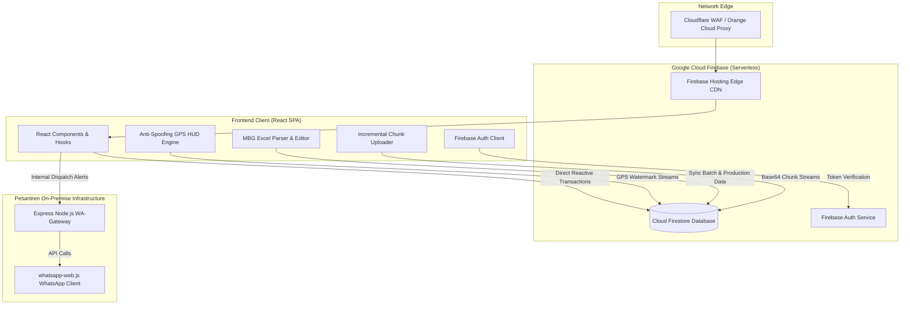
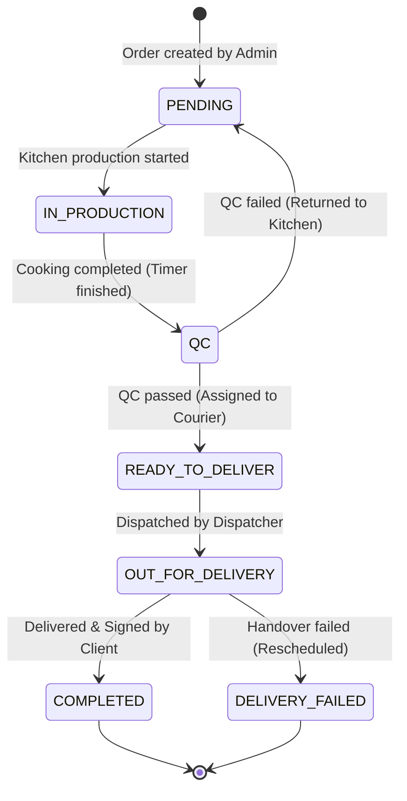

# Al-Umanaa Integrated Cooperative & MBG Platform

An enterprise-grade, high-performance, and secure hybrid-serverless ecosystem custom-built for **Pesantren Al-Umanaa (Al-Umanaa Islamic Boarding School)**. This platform unifies two mission-critical operations:
1. **Koperasi Order Fulfillment & Delivery Tracking System**: End-to-end commercial order lifecycle—from administrator intake, kitchen production timers, quality control audits, and real-time GPS courier tracking, to digital client handovers and receipt signatures.
2. **Program MBG (Makan Bergizi Gratis) Ecosystem**: Comprehensive institutional catering and nutrition logistics—featuring smart Excel workbook parsing, live in-app spreadsheet editing and auto-recalculation, dynamic kitchen batch schedules, school distribution tracking, and automated multi-page official government-standard PDF/DOCX reporting.

---

## System Badges and Metrics

[](https://golang.org/)
[](https://react.dev/)
[](https://www.typescriptlang.org/)
[](https://firebase.google.com/)
[](https://www.cloudflare.com/)
[](https://vitest.dev/)
[](#correctness-properties-and-pbt)
[](https://www.docker.com/)
[](https://kubernetes.io/)

---

## Core System Architecture & Modules

### 1. Program Makan Bergizi Gratis (MBG) Ecosystem

The MBG module is an institutional catering automation suite designed for large-scale school nutrition programs:

- **Smart Excel Workbook Parser (`productionSheetParser.ts`)**:
  - Automatically parses official 5-sheet workbooks: *Menu MBG*, *Kebutuhan Bahan Baku*, *Kebutuhan Bumbu Dapur*, *Distribusi Sekolah / Penerima Manfaat*, and *Catatan Dapur*.
  - Intelligently identifies dynamic header rows, detects categories (Bahan Basah, Bahan Kering, Bumbu Dapur), normalizes units (kg, gram, butir, ikat, pcs), and maps student counts per school/grade level.
  - Automatically binds the primary supplier to **Koperasi Al Umanaa Sejahtera Mandiri**.
- **Live In-App Spreadsheet Editor & Auto-Recalculation**:
  - Full-featured 5-tab interactive interface mirroring the official Excel structure directly within the browser.
  - In-place editing of ingredients, grammage, student counts, and kitchen notes with instant recalculation of total weights and procurement requirements.
- **Synchronized MBG Operational Lifecycle**:
  $$\text{Admin MBG (Perencanaan \& Impor)} \longrightarrow \text{Produksi MBG (Pengolahan)} \longrightarrow \text{Distribusi MBG (Serah Terima Sekolah)}$$
  - Real-time batch filtering ensures kitchen and distribution teams focus strictly on the active schedule.
  - Direct handover to school distribution teams without manual re-entry.
- **Official Institutional Exporters (PDF & DOCX)**:
  - Generates web-landscape PDF and Word (.docx) documents matching official agency standards.
  - Includes multi-page stacked 4-photo activity documentation layout with geolocation, school metadata, and timestamps.

### 2. Koperasi Order Fulfillment & Delivery Tracking

- **Direct Serverless-to-Firestore Architecture**:
  - React SPA communicates directly with Google Cloud Firestore and Firebase Authentication.
  - Eliminates API gateway latency and auto-scales for high-volume pesantren events.
- **Edge WAF & Proxy Layer (Cloudflare)**:
  - Orange Cloud DNS proxying hides underlying Firebase Hosting IP addresses.
  - Edge challenge-response screens block automated bots and DDoS threats while enforcing strict HTTPS.
- **Secure Live-HUD Camera & Anti-Spoofing Engine**:
  - **Monotonic Clock Synchronization**: Compares client and server timestamps on startup and tracks real-time intervals via `performance.now()` to render local timezone tampering useless.
  - **GPS Verification & Timezone Validation**: Rejects mock locations and verifies device coordinate bounds against Indonesian timezones (WIB, WITA, WIT).
  - **Reverse Geocoding**: Queries OpenStreetMap Nominatim to stamp exact village, sub-district, and regency onto the camera watermark.
- **Triple-Proof Delivery Verification**:
  - Captures a complete delivery lifecycle audit:
    1. Departure proof (Start OTW photo with GPS watermark).
    2. Arrival/Delivery documentation photo.
    3. Recipient validation with digital signature.
- **Asynchronous Base64 Chunk-loading Protocol**:
  - Slices large photos and signatures into $\le 512$ KB binary chunks written sequentially to Firestore subcollections: `/{collection}/{fileId}/chunks/{index}`.
  - Assembled on-the-fly inside custom React hooks (`useProductImage.ts`), preventing Firestore document size limit overflows ($1$ MB).

### 3. Database Performance & Quota Optimization

- **Firestore Query Bloat Elimination**:
  - Audited and refactored queries across dashboard, reminders, catalog, and notifications to use indexed limits, preventing quota exhaust.
- **Bundle Trimming & Asset Optimization**:
  - Removed bloated static legacy data (`tkpiDatabase.json` and static spreadsheet masters) to reduce frontend bundle size and mobile memory consumption.
- **Robust Multi-Date Fallback & Indexing**:
  - Combined `eventDate` and `createdAt` fallbacks across production, dispatch scheduler, and handover queues to ensure zero missing orders across all role views.

---

## High-Level System Topology


```mermaid
graph TB
    subgraph Client["Frontend Client (React SPA)"]
        UI[React Components & Hooks]
        MBGParser[MBG Excel Parser & Editor]
        GPS[Anti-Spoofing GPS HUD Engine]
        Chunker[Incremental Chunk Uploader]
        Auth[Firebase Auth Client]
    end

    subgraph FirebaseCloud["Google Cloud Firebase (Serverless)"]
        Firestore[(Cloud Firestore Database)]
        FBAuth[Firebase Auth Service]
        FBHosting[Firebase Hosting Edge CDN]
    end

    subgraph Edge["Network Edge"]
        CF[Cloudflare WAF / Orange Cloud Proxy]
    end

    subgraph LocalServices["Pesantren On-Premise Infrastructure"]
        WAGateway[Express Node.js WA-Gateway]
        WABot[whatsapp-web.js WhatsApp Client]
    end

    CF --> FBHosting
    FBHosting --> UI
    UI -->|Direct Reactive Transactions| Firestore
    GPS -->|GPS Watermark Streams| Firestore
    MBGParser -->|Sync Batch & Production Data| Firestore
    Chunker -->|Base64 Chunk Streams| Firestore
    Auth -->|Token Verification| FBAuth
    
    UI -->|Internal Dispatch Alerts| WAGateway
    WAGateway -->|API Calls| WABot
```

---

## Transactional State Machine

Order operations follow a strict state transition flow enforced by Firestore security rules:


```mermaid
stateDiagram-v2
    [*] --> PENDING: Order created by Admin
    PENDING --> IN_PRODUCTION: Kitchen production started
    IN_PRODUCTION --> QC: Cooking completed (Timer finished)
    QC --> READY_TO_DELIVER: QC passed (Assigned to Courier)
    QC --> PENDING: QC failed (Returned to Kitchen)
    READY_TO_DELIVER --> OUT_FOR_DELIVERY: Dispatched by Dispatcher
    OUT_FOR_DELIVERY --> COMPLETED: Delivered & Signed by Client
    OUT_FOR_DELIVERY --> DELIVERY_FAILED: Handover failed (Rescheduled)
    COMPLETED --> [*]
    DELIVERY_FAILED --> [*]
```

---

## Security Configuration & Role-Based Access Control (RBAC)

Database access is secured via [firestore.rules](./firestore.rules). User access is validated against custom authentication claims:

| Role | Access Scope |
| :--- | :--- |
| **Admin** | Full database management, product catalog, user claims, and global configuration. |
| **Tim Dapur** | Read-write access to kitchen queues, ingredient stock quantities, and production timers. |
| **Distribusi** | Allocate courier tasks, manage dispatch queues, and monitor delivery progress. |
| **Kurir** | Restricted write-access for GPS live streams, transit checkpoints, and POD photo chunks. |
| **Monitoring** | Read-only access to KPI metrics, financial reports, and historical order audits. |
| **Admin MBG** | Full access to Excel workbook imports, 5-tab live recalculation, menu planning, and official reporting. |

---

## Correctness Properties & Property-Based Testing (PBT)

The codebase incorporates **18 distinct correctness properties** verified through offline Property-Based Testing (fast-check & vitest):

- **Property 5**: Kitchen queue filters only active `PENDING` or `IN_PRODUCTION` orders, sorted chronologically.
- **Property 9**: Geolocation coordinates are strictly range-validated ($[-90, 90]$ latitude, $[-180, 180]$ longitude) prior to persistence.
- **Property 10**: GPS staleness detection triggers warnings if updates halt for $> 5$ minutes during transit.
- **Property 11**: Base64 chunking round-trip verifies that slicing and reassembly reconstruct the exact original binary payload.
- **Property 12**: Client chunk structures strictly preserve indices, order, and size limits.
- **Property 13**: Uploads exceeding client-side limits ($> 15$ MB) are rejected at the UI boundary.
- **Property 17**: Cumulative filtering on dashboards correctly computes logical `AND` checks.
- **Property 18**: Proof of Delivery requires valid signature canvas strokes and photo attachments before status promotion to `COMPLETED`.

---

## Local Development & Deployment

### Prerequisites

- [Node.js 18+](https://nodejs.org/)
- [Firebase CLI](https://firebase.google.com/docs/cli)

### 1. Installation

Install all dependencies in the frontend directory:

```bash
cd frontend
npm install
```

### 2. Environment Configuration

Create `.env.production` inside `frontend/` containing your production Firebase details:

```env
VITE_FIREBASE_API_KEY=your_production_api_key
VITE_FIREBASE_AUTH_DOMAIN=al-umana-koperasi.firebaseapp.com
VITE_FIREBASE_PROJECT_ID=al-umana-koperasi
VITE_FIREBASE_STORAGE_BUCKET=al-umana-koperasi.firebasestorage.app
VITE_FIREBASE_MESSAGING_SENDER_ID=your_messaging_sender_id
VITE_FIREBASE_APP_ID=your_app_id
VITE_FIREBASE_MEASUREMENT_ID=your_measurement_id
VITE_API_BASE_URL=
```

### 3. Build & Test

Run unit and property-based tests:

```bash
npm run test
```

Build the minified production bundle:

```bash
npm run build
```

### 4. Deploying to Firebase Hosting

Deploy the frontend build to Firebase Hosting:

```bash
npx firebase deploy --only hosting
```

---

## On-Premise WhatsApp Gateway (Local Service)

The system includes an on-premise WhatsApp service (`wa-gateway`) interfacing with WhatsApp Web to deliver automatic dispatch alerts:

```bash
cd wa-gateway
npm install
node server.js
```

Scan the terminal QR code using WhatsApp to link the session. The service listens on port `8000`.

---

## Production Containerization & Orchestration

### 1. Docker Compose Production Deployment

A pre-configured production Docker Compose architecture is provided in [docker-compose.prod.yml](./docker-compose.prod.yml):

- **Backend Service**: Serves the Go backend production target with `.env.production`.
- **Frontend Service**: Hosts the compiled static React application served via Nginx with reverse caching.
- **WA-Gateway**: Runs Node.js Express with headless Chromium dependencies and a persistent volume `wa_session` (`/app/.wwebjs_auth`) to preserve login state across container restarts.

```bash
docker-compose -f docker-compose.prod.yml up --build -d
```

### 2. Enterprise Kubernetes Deployment

Kubernetes manifests are organized within the [k8s/](./k8s) directory for high-availability cluster deployments:

- **Namespace (`namespace.yaml`)**: Isolates resources in the `al-umana` namespace.
- **Config & Secrets (`configmap.yaml`, `secrets.yaml`)**: Stores environment configuration and base64 Firebase Service Account credentials.
- **Backend Deployment (`backend-deployment.yaml`)**: 2 replicas with liveness and readiness probes on port `8080`.
- **Frontend Deployment (`frontend-deployment.yaml`)**: 2 replicas served via Nginx.
- **WA Gateway (`wa-gateway-deployment.yaml`)**: Singleton replica backed by a PersistentVolumeClaim for session retention.
- **Horizontal Pod Autoscaling (`hpa.yaml`)**: Scales frontend pods (2–4 replicas) when CPU $\ge 60\%$, and backend pods (2–6 replicas) when CPU $\ge 50\%$.
- **Ingress Controller (`ingress.yaml`)**: Routes traffic:
  - `/api/*` $\rightarrow$ Backend ClusterIP
  - `/wa/*` $\rightarrow$ WA-Gateway ClusterIP
  - `/*` $\rightarrow$ Frontend ClusterIP

```bash
kubectl apply -f k8s/namespace.yaml
kubectl apply -f k8s/
```
